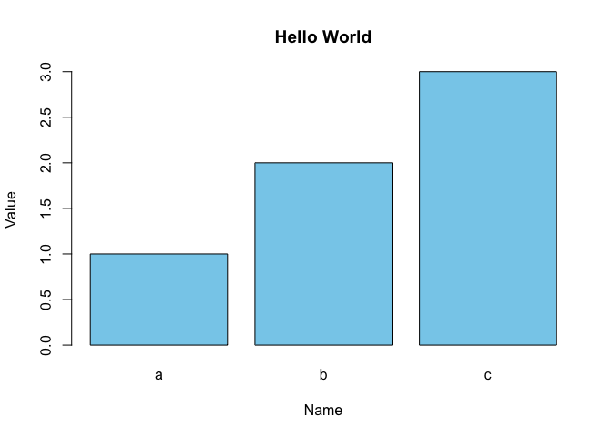
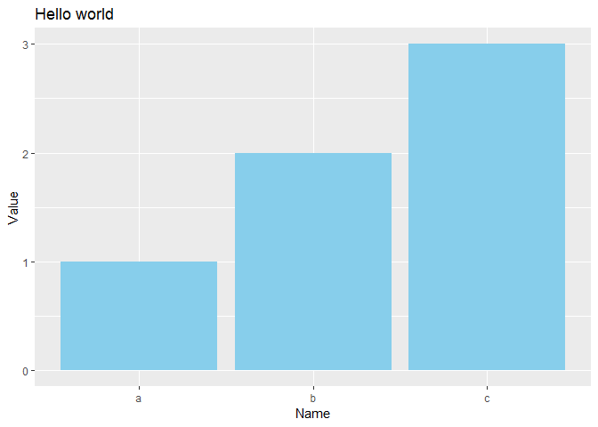

# Bar Chart

## Demo using R

Create data frame

``` r
nameasfactor <- as.factor(c("a","b","c"))
df <- data.frame(
  Name = nameasfactor,
  Value = c(1,2,3))
```

Display the data frame

``` r
print(df)
```

    ##   Name Value
    ## 1    a     1
    ## 2    b     2
    ## 3    c     3

*Note that when passing the data frame it displays the axis names, this
is because it has where to get the data from*, if you pass the column as
parameter it doesn’t have a way to determine those axis names
automatically.

## Bar chart using Core R

Create a bar chart

``` r
barplot(
  names= df$Name,
  height= df$Value,
  col= "skyblue",
  main= "Hello World",
  xlab="Name",
  ylab= "Value"
)
```

<!-- -->

### Help files

`?barplot` to see parameters help `?par`

## Bar chart using Lattice library

Create a bar chart

``` r
barchart(
  x = Value ~ Name,
  data = df,
  col = "skyblue",
  main="Hello World",
  xlab="Name",
  ylab="Value")
```


### Help files

`?barchart`
`?formula`

## Bar chart using GGPlot

Create a bar chart

``` r
ggplot(
  data = df,
  aes(
    x = Name,
    y = Value)) +
  geom_bar(
    stat = "identity",
    fill = "skyblue") +
  ggtitle("Hello world") +
  xlab("Name") +
  ylab("Value")
```



### Help files

`?ggplot`
`?aes`
`?geom_bar`
`?ggtitle`
