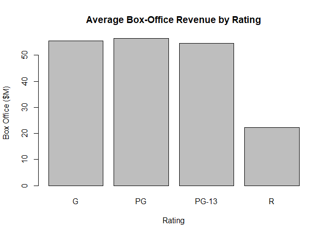

# Bar Chart (Qualitative & Quantitative)

With this chart we only see comparisson by one aggregate value for one category, to compare more aggregate values at once we have to see additional data visualization.

## Highlights

* Comparison between one aggregate and a category

## Envrionment Setup


``` r
movies <- read.csv("../data/Movies.csv")
main_label <- "Average Box-Office Revenue by Rating"
rating_label <- "Rating"
box_office_label <- "Box Office ($M)"
```

## Core R Library

``` r
average <- tapply(
  movies$Box.Office,
  movies$Rating,
  mean)

print(average)
```

    ##        G       PG    PG-13        R 
    ## 55.47561 56.40439 54.56134 22.26118

``` r
barplot(
  height = average,
  main = main_label,
  xlab = rating_label,
  ylab = box_office_label
)
```



## Lattice Library

> You need to install dplyr library `install.packages("dplyr")`

Create table of average box office by rating

``` r
average  <- movies %>% 
  select(Rating, Box.Office) %>%
  group_by(Rating) %>%
  summarize(Box.Office = mean(Box.Office)) %>%
  as.data.frame()

print(average)
```

    ##   Rating Box.Office
    ## 1      G   55.47561
    ## 2     PG   56.40439
    ## 3  PG-13   54.56134
    ## 4      R   22.26118


``` r
barchart(
  x = Box.Office ~ Rating,
  data = average,
  main = main_label,
  xlab = rating_label,
  ylab = box_office_label)
```


## GGPlot Library

``` r
ggplot(
  data = average,
  aes(x =Rating, y = Box.Office)) +
  geom_bar(stat = "identity") +
  ggtitle(main_label) +
  xlab(rating_label) +
  ylab(box_office_label)
```


