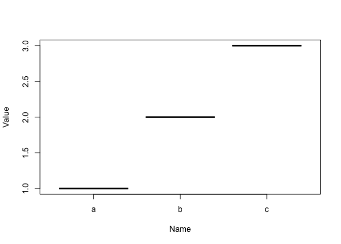
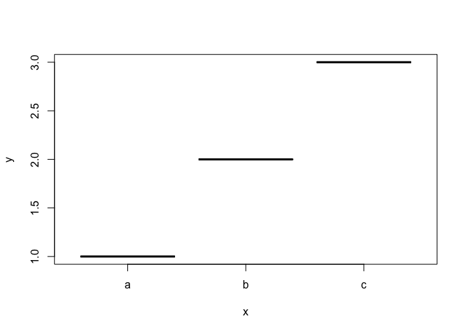
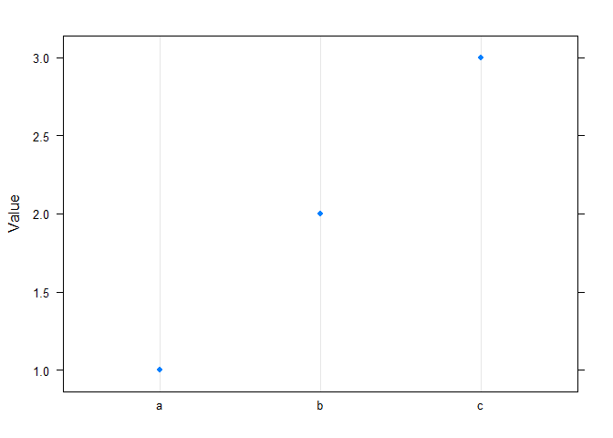
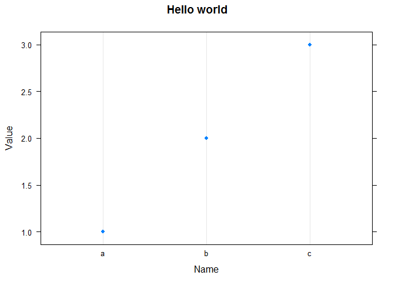
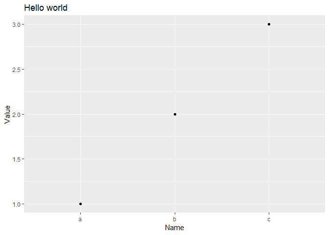

# Basic Plot in R


## Demo using R

Create data frame

``` r
nameasfactor <- as.factor(c("a","b","c"))
df <- data.frame(
  Name = nameasfactor,
  Value = c(1,2,3))
```

Display the data frame

``` r
print(df)
```

    ##   Name Value
    ## 1    a     1
    ## 2    b     2
    ## 3    c     3

*Note that when passing the data frame it displays the axis names, this
is because it has where to get the data from*, if you pass the column as
parameter it doesn’t have a way to determine those axis names
automatically.

## Example using Core R Plot

Plot the data frame using default parameters

``` r
plot(df)
```

<!-- -->

Plot using default parameter order

``` r
plot(df$Name, df$Value)
```

<!-- -->

Plot using named parameters

``` r
plot(  
  x = df$Name,
  y = df$Value)
```

<!-- -->


### Help files

`?plot` to see parameters help `?par`

## Example using Lattice

### R - Installation process

Install the lattice package

`install.packages("lattice")`

Loading lattice package

``` r
library(lattice)
```

    ## Warning: package 'lattice' was built under R version 3.5.2

### Example

Create a data frame

``` r
df <- data.frame(
  Name = c("a","b","c"),
  Value = c(1,2,3))
```

### Plot

Plot with defaults

``` r
dotplot(
  x = Value ~ Name,
  data = df
)
```



Plot with parameters

``` r
dotplot(
  x = Value ~ Name,
  data = df,
  main="Hello world",
  xlab="Name",
  ylab="Value")
```



## Example using GGPlot

### Installation process

Install the ggplot2 package
`install.package(ggplot2)`

Load the ggplot2 package

``` r
library(ggplot2)
```

Create a data frame

``` r
df <- data.frame(
  Name = c("a","b","c"),
  Value = c(1,2,3))
```

### Plot

Plot with defaults

``` r
ggplot(
data = df,
  aes(
    x = Name,
    y = Value)) +
    geom_point()
```


Plot with parameters
*Note ggplot2 add layers to the chart*

``` r
ggplot(
  data = df,
  aes(
    x = Name,
    y = Value)) +
  geom_point() +
  ggtitle("Hello world") + 
  xlab("Name") +
  ylab("Value")
```

