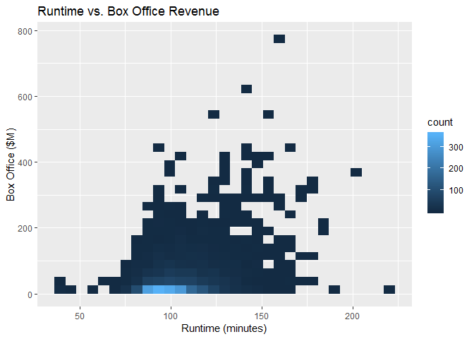

# Binned Frequency Heatmap

The heat map can be seen as a histogram, but instead of using bars, the dark color represents the most concentration or most samples.


AKA:

* Binned Scatter plot
* 2D histogram

## It Measures

  * Joint frequency
  * Large data sets

## Environment Setup

``` r
movies <- read.csv('../data/Movies.csv')
main_label <- "Runtime vs. Box Office Revenue"
runtime_in_minutes_label <- "Runtime (minutes)"
box_office_label <- "Box Office ($M)"
density_label <- "Density"
```


## GGPlot Library

Create a frequency heatmap

``` r
ggplot(
  data = movies,
  aes(x =Runtime, y = Box.Office)) +
  stat_bin2d() +
  ggtitle(main_label) +
  xlab(runtime_in_minutes_label) +
  ylab(box_office_label)
```

