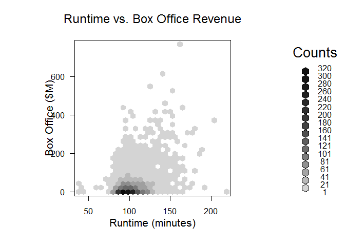
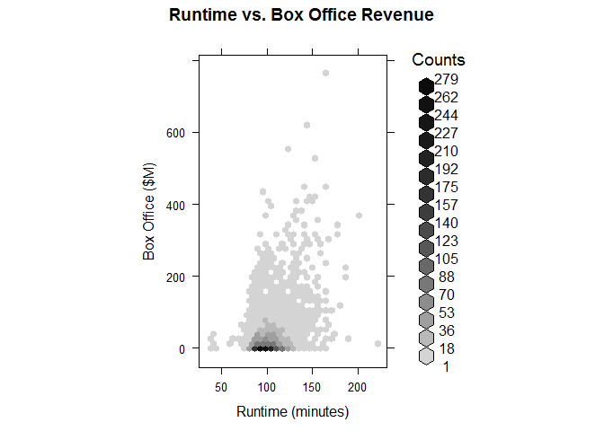
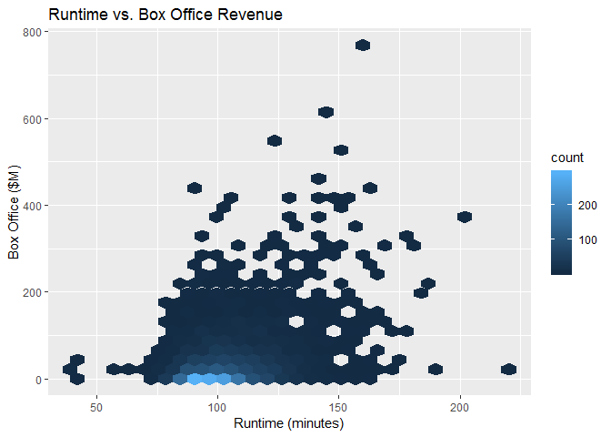

# Hexagonal Binned Frequency Heatmap

## It Measures

* Used to answer the same questions than Binned Frequence Heatmap.
* Hexagonal bins
* Preferred shape over squared or circular shapes

## Environment Setup

``` r
movies <- read.csv('../data/Movies.csv')
main_label <- "Runtime vs. Box Office Revenue"
runtime_in_minutes_label <- "Runtime (minutes)"
box_office_label <- "Box Office ($M)"
density_label <- "Density"
```

Now we need to install the package hexbin `install.packages("hexbin")`.

Now we load hexbin library

``` r
library(hexbin)
```

## Core R Library


``` r
hexbin <- hexbin(
  x = movies$Runtime,
  y = movies$Box.Office,
  xbins = 30,
  xlab = runtime_in_minutes_label,
  ylab = box_office_label)

plot(
  x = hexbin,
  main = main_label)
```



## Lattice Library

``` r
hexbinplot(
  x = Box.Office ~ Runtime,
  data = movies,
  xbins = 30,
  main = main_label,
  xlab = runtime_in_minutes_label,
  ylab = box_office_label)
```



## GGPlot Library


``` r
ggplot(
  data = movies,
  aes(x = Runtime, y = Box.Office)) +
  stat_binhex() +
  ggtitle(main_label) + 
  xlab(runtime_in_minutes_label) +
  ylab(box_office_label)
```


