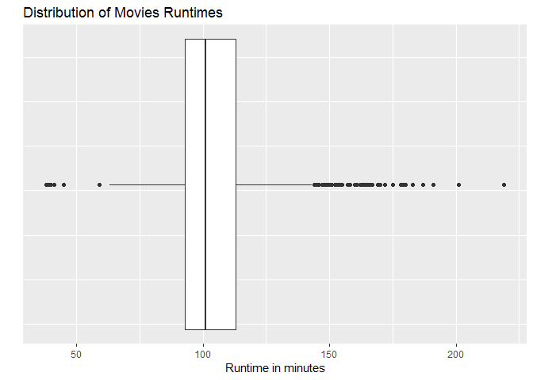

# Box Plot

## Highlights

* No dimension on y-axis
    + Min Value
    + Max  Value
    + First quartile
    + Median
    + Third quartile
    + Outliers
* Location of data
* Spread
* Range

## We Can Answer Questions Like:

  1. What is the average movie runtime?
  2. Are there any outliers?
  3. How spread out are the movie runtimes?
  4. What is the shape of the runtime distribution?


## Setup environment

```r
movies = read.csv("../data/Movies.csv")
```

## Core R Library

```r
boxplot(
  x = movies$Runtime,
  horizontal = TRUE,
  main = "Distribution of Movie Runtimes",
  xlab = "Runtime in minutes"
)
```


## Lattice Library

``` r
bwplot(
  x = ~Runtime,
  data = movies,
  main = main_title,
  xlab = x_lab)
```


## GGPlot Library

``` r
ggplot(
  data = movies,
  aes(x= Runtime, y=Runtime)) +
  geom_boxplot() + 
  coord_flip() +
  ggtitle(main_title) + 
  xlab("") +
  ylab(x_lab) +
  theme(
    axis.text.y = element_blank(),
    axis.ticks.y = element_blank())
```

    ## Warning: Continuous x aesthetic -- did you forget aes(group=...)?

