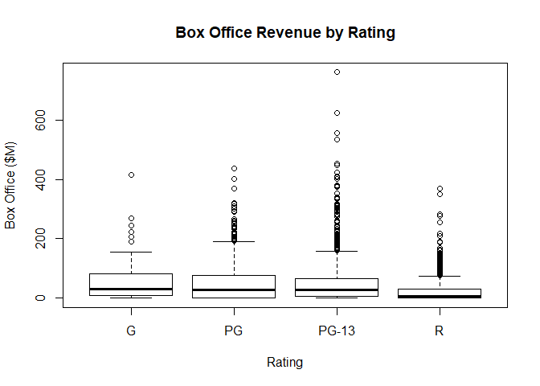
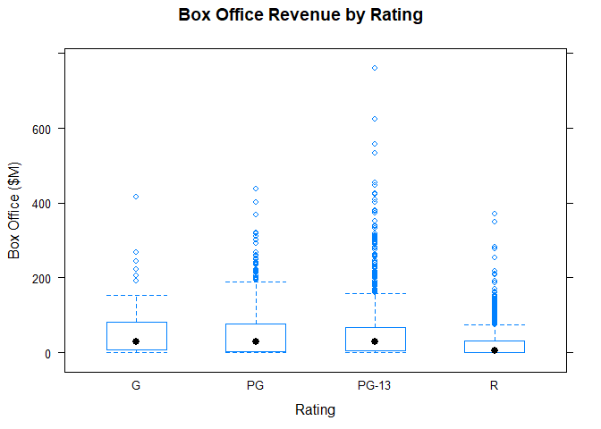
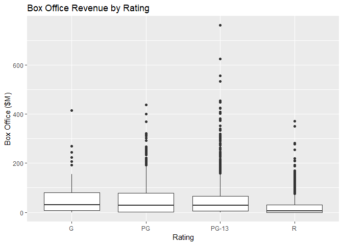

# Box Plot (Qualitative & Quantitative)

X-axis we use categorical variable, and y-axis numeric variable.

## Highlights

## It Measures

* Location
* Spread
* Outliers

## Environment Setup

``` r
movies <- read.csv("../data/Movies.csv")
main_label <- "Average Box-Office Revenue by Rating"
rating_label <- "Rating"
box_office_label <- "Box Office ($M)"
```


## Core R Library
``` r
main_label <- "Box Office Revenue by Rating"
plot(
  x = movies$Rating,
  y = movies$Box.Office,
  main = main_label,
  xlab = rating_label,
  ylab = box_office_label)
```



## Lattice Library


``` r
main_label <- "Box Office Revenue by Rating"
bwplot(
  x = Box.Office ~ Rating,
  data = movies,
  main = main_label,
  xlab = rating_label,
  ylab = box_office_label)
```




## GGPlot Library

``` r
main_label <- "Box Office Revenue by Rating"
ggplot(
  data = movies,
  aes(x = Rating, y = Box.Office)) +
  geom_boxplot() +
  ggtitle(main_label) + 
  xlab(rating_label) +
  ylab(box_office_label)
```

