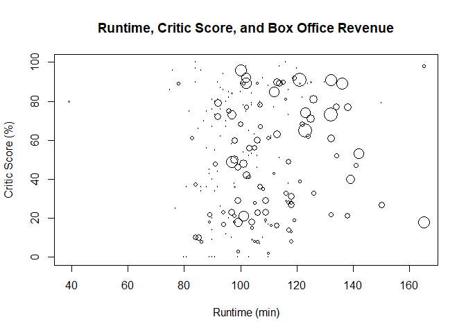
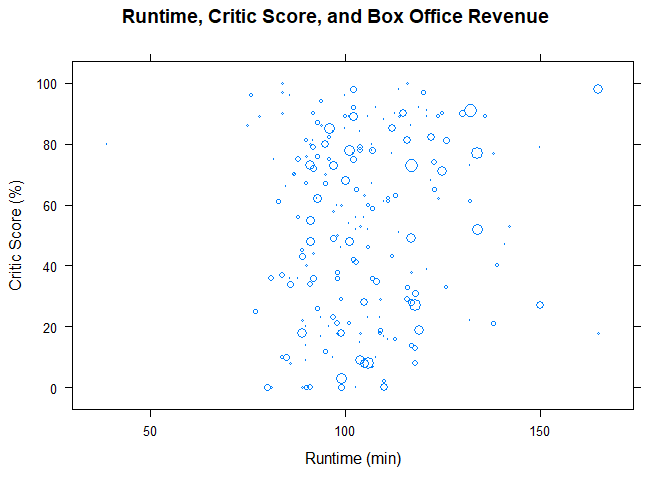
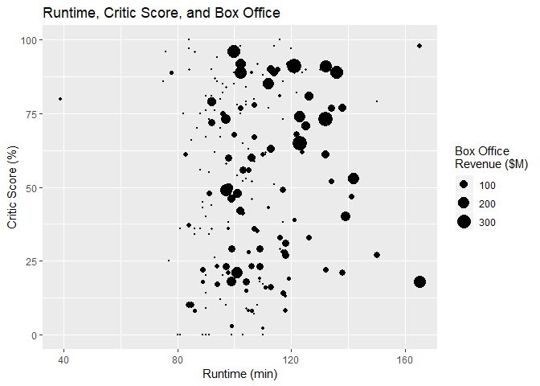

# Bubble Chart

## Highlights

* Scatterplot
* Numeric size scale
* Area vs Diameter

## Environment Setup


``` r
library(tidyverse)
library(RColorBrewer)
library(scatterplot3d)

gradient <- brewer.pal(5, "YlOrRd")
palette(gradient)
movies <- read.csv("../data/movies.csv")
movies2014 <- movies[movies$Year == 2014,]

``` r
getSize <- function(values, scale){
  ratio <- values / max(values)
  size <- sqrt(ratio/pi)
  size * scale
}
```
## Core R Library

``` r
plot(
  x = movies2014$Runtime,
  y = movies2014$Critic.Score,
  cex = getSize(movies2014$Box.Office, 5),
  main = "Runtime, Critic Score, and Box Office Revenue",
  xlab = "Runtime (min)",
  ylab = "Critic Score (%)")
```



## Lattice Library

``` r
xyplot(
  data = movies2014,
  x = Critic.Score ~ Runtime,
  cex = getSize(movies$Box.Office,5),
  main = "Runtime, Critic Score, and Box Office Revenue",
  xlab = "Runtime (min)",
  ylab = "Critic Score (%)")
```




## GGPlot Library


``` r
 movies2014 %>%
  ggplot(
    aes(x = Runtime,
        y = Critic.Score,
        size = Box.Office, 10)) +
  geom_point() +
  scale_size_area() +
  ggtitle("Runtime, Critic Score, and Box Office") +
  xlab("Runtime (min)") +
  ylab("Critic Score (%)") +
  labs(size = "Box Office\nRevenue ($M)")
```

