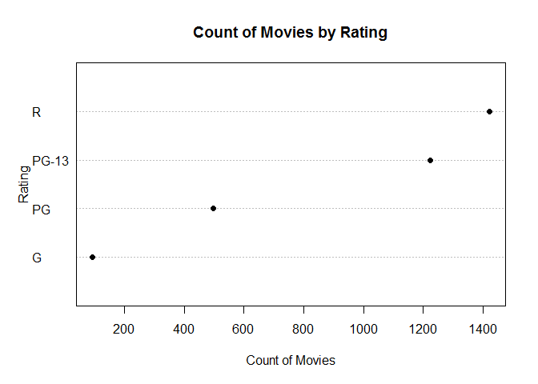
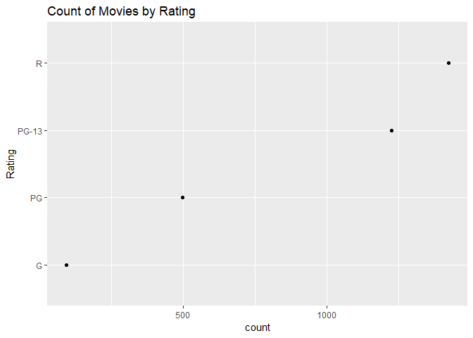

# Cleveland Dot Plot

## Setup the environment

Set working directory (no needed if working on R project)
`setwd("path")`

Load movie data from CSV file

``` r
movies <- read.csv("../data/Movies.csv")
```

Peek at the data

``` r
head(movies)
```

    ##                              Title Year Rating Runtime Critic.Score
    ## 1             The Whole Nine Yards 2000      R      98           45
    ## 2 Cirque du Soleil: Journey of Man 2000      G      39           45
    ## 3                        Gladiator 2000      R     155           76
    ## 4                         Dinosaur 2000     PG      82           65
    ## 5                Big Momma's House 2000  PG-13      99           30
    ## 6            Gone in Sixty Seconds 2000  PG-13     118           24
    ##   Box.Office Awards International
    ## 1       57.3  FALSE         FALSE
    ## 2       13.4   TRUE         FALSE
    ## 3      187.3   TRUE          TRUE
    ## 4      135.6   TRUE         FALSE
    ## 5        0.5   TRUE          TRUE
    ## 6      101.0   TRUE         FALSE

## Univariate visualization for a qualitative variable

### Core R library

Create a Cleveland dot plot, *this is pretty much the same than the bar chart*

``` r
dotchart(
  x = table(movies$Rating),
  pch = 16,
  main = "Count of Movies by Rating",
  xlab = "Count of Movies",
  ylab = "Rating"
)
```

    ## Warning in dotchart(x = table(movies$Rating), pch = 16, main = "Count
    ## of Movies by Rating", : 'x' is neither a vector nor a matrix: using
    ## as.numeric(x)



### Lattice Library - R

Cleveland dot plot
------------------

Create Cleveland dot plot

``` r
dotplot(
  x = Rating ~ Count,
  data = ratings,
  main = "Count of Movies by Rating",
  ylab = "Rating")
```


### GGPlot Library - R


``` r
ggplot(
  data= movies,
  aes(x= Rating)) +
  geom_point(stat ="count") +
  coord_flip() +
  ggtitle("Count of Movies by Rating")
```


