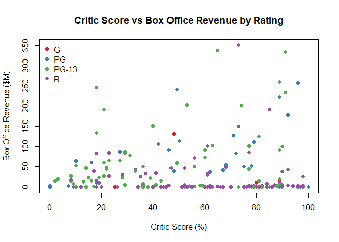
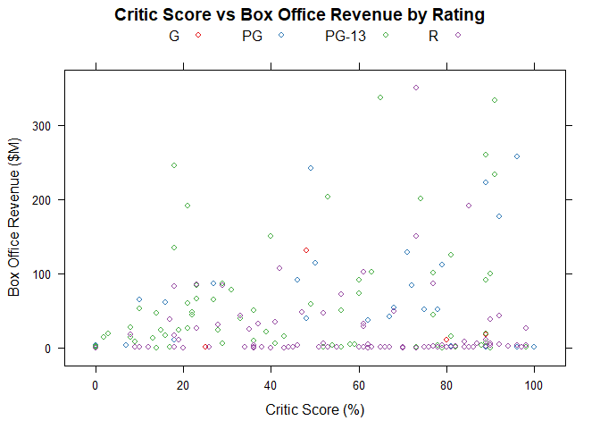
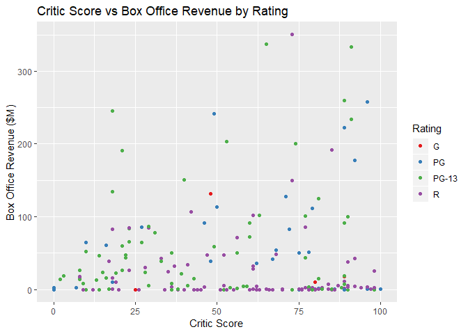

# Color Coded Scatter Plot

## Hihglights

* Scatterplot
* Color-coded categories
* Discrete color palette
* Small number of colors (12 or less)

## Environment Setup

``` r
library(RColorBrewer)
```

    ## Warning: package 'RColorBrewer' was built under R version 3.5.2

``` r
movies2014 <- read.csv("../data/movies.csv")
movies2014 <- movies2014[movies2014$Year == 2014,]

colors <- brewer.pal(4, "Set1")
```

## Core R Library


``` r
plot(
  x = movies2014$Critic.Score,
  y = movies2014$Box.Office,
  col = colors[as.integer(movies2014$Rating)],
  pch = 19,
  main = "Critic Score vs Box Office Revenue by Rating",
  xlab ="Critic Score (%)",
  ylab = "Box Office Revenue ($M)")

# Add a legend
legend(x = "topleft",
       legend = levels(movies2014$Rating),
       col = colors[1:4],
       pch = 19)
```



## Lattice Library


``` r
library(lattice)
library(RColorBrewer)
```

    ## Warning: package 'RColorBrewer' was built under R version 3.5.2

``` r
library(tidyverse)
```

``` r
colors <- brewer.pal(4, "Set1")
shapes <- c(1,4,2,0)
movies <- read.csv("../data/movies.csv")
movies2014 <- movies[movies$Year == 2014,]
```

Color-coded Scatterplot
-----------------------

``` r
movies2014 %>%
xyplot(
  x = Box.Office ~ Critic.Score,
  group = Rating,
  par.settings = list(
    superpose.symbol = list(
      col = colors)),
  auto.key = list(columns = 4),
  main = "Critic Score vs Box Office Revenue by Rating",
  xlab = "Critic Score (%)",
  ylab = "Box Office Revenue ($M)")
```



## GGPlot Library

``` r
movies2014 %>%
  ggplot(
    aes(x = Critic.Score, 
        y = Box.Office,
        color = Rating)) +
  scale_color_manual(
    name = "Rating",
    labels = levels(movies2014$Rating),
    values = colors) +
  geom_point() +
  ggtitle("Critic Score vs Box Office Revenue by Rating") +
  xlab("Critic Score") +
  ylab("Box Office Revenue ($M)")
```

