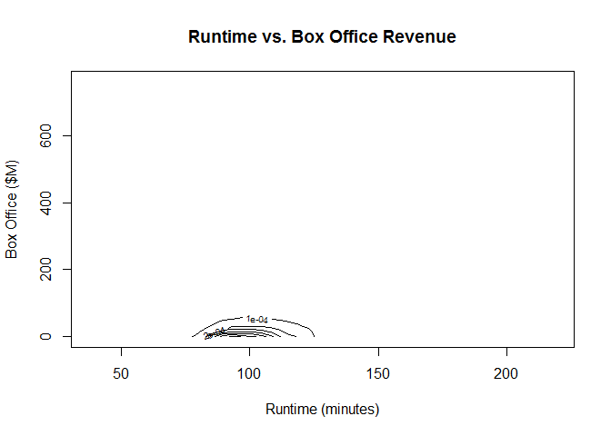
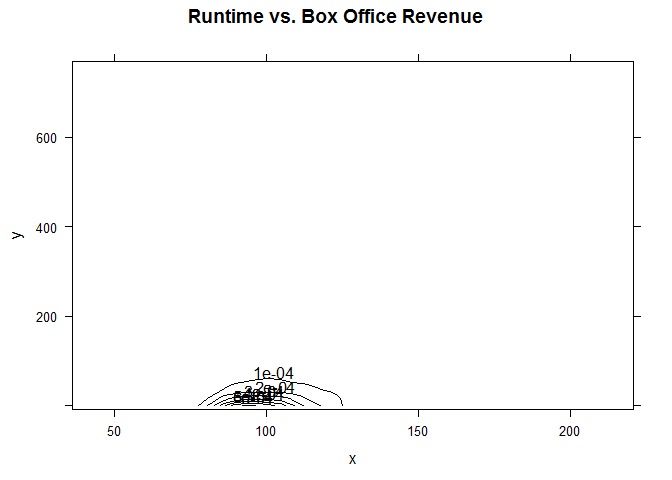
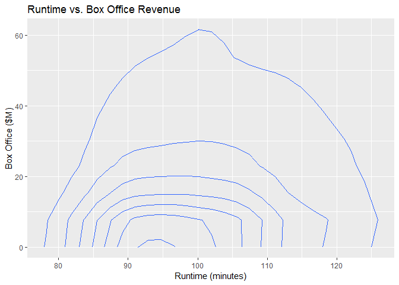

# Contour Plot

This represents visualization also on Z-axis, so there is an elevation towards you. this is where the data is concentrated.

## It Measures

    * Countour lines
    * Joint density

## It needs MASS Package

Details [here](mass_package.md)

## Environment Setup

``` r
movies <- read.csv('../data/Movies.csv')
main_label <- "Runtime vs. Box Office Revenue"
runtime_in_minutes_label <- "Runtime (minutes)"
box_office_label <- "Box Office ($M)"
density_label <- "Density"
```

## Core R Library


Create a contour plot of density, as you can see for this scenario this visualization is not the best.

``` r
contour(
  x = density2d$x,
  y = density2d$y,
  z = density2d$z,
  main = main_label,
  xlab = runtime_in_minutes_label,
  ylab = box_office_label)
```



## Lattice Library


``` r
contourplot(
  x = z ~ x* y,
  data = grid,
  main = main_label,
  xlab = 
)
```



## GGPlot Library


``` r
ggplot(
  data = movies,
  aes(x = Runtime, y = Box.Office)) +
  geom_density2d() +
  ggtitle(main_label) +
  xlab(runtime_in_minutes_label) + 
  ylab(box_office_label)
```

