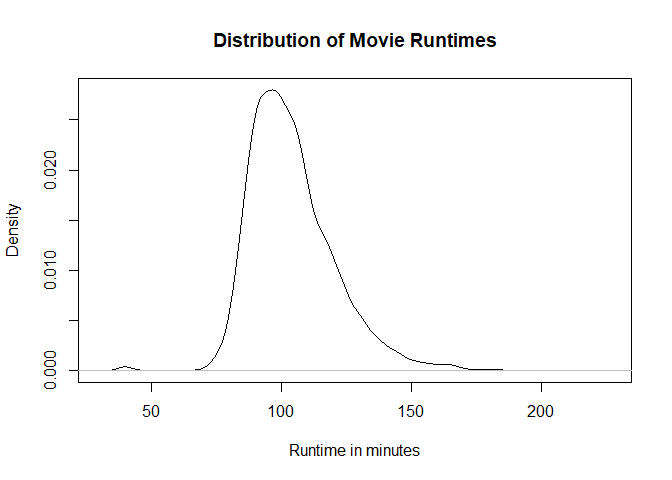

# Density Plot


## Highlights

* Shape
* Location
* Spread
* Smooth


## R Environment Setup


```r
movies = read.csv("../data/Movies.csv")
```

## Core R Library


Creating a density plot of runtime

```r
plot(
  x = density(movies$Runtime),
  main = "Distribution of Movie Runtimes",
  xlab = "Runtime in minutes"
)
```




## Lattice Library

```r
densityplot(
  x = ~Runtime,
  data = movies,
  main = main_title,
  xlab = x_lab)
```


## GGPlot Library


```r
ggplot(
  data = movies,
  aes(x=Runtime)) +
  geom_density() +
  ggtitle(main_title) +
  xlab(x_lab)
```


