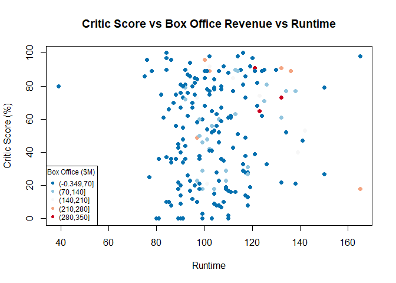
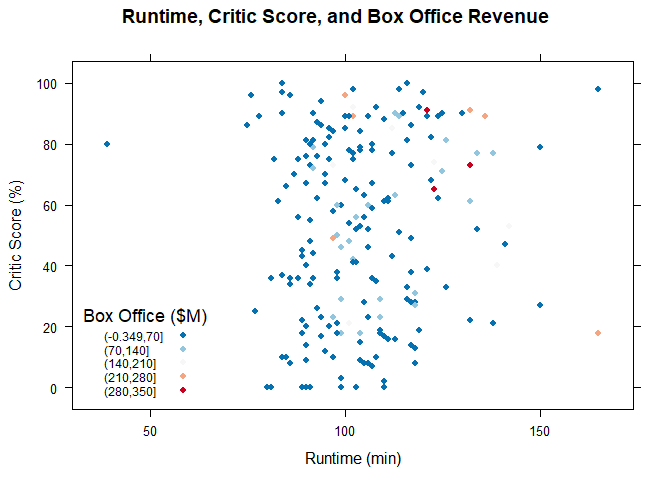
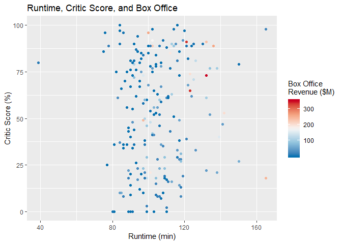

# Divergent Color Scale Scatter Plot

## Highlights

* Scatterplot
* Numeric color scale
* Continuous color palette
* Three-color gradient

## Environment Setup

``` r
library(tidyverse)
library(RColorBrewer)
library(scatterplot3d)

gradient <- brewer.pal(5, "YlOrRd")
palette(gradient)
movies <- read.csv("../data/movies.csv")
movies2014 <- movies[movies$Year == 2014,]
```

## Core R Library


``` r
divergent <- rev(brewer.pal(5,"RdBu"))
palette(divergent)

plot(
   x = movies2014$Runtime,
   y = movies2014$Critic.Score,
   col = cut(movies2014$Box.Office, 5),
   pch = 16,
   main = "Critic Score vs Box Office Revenue vs Runtime",
   xlab = "Runtime",
   ylab = "Critic Score (%)")

legend(
  x = "bottomleft",
  title = "Box Office ($M)",
  legend = levels(cut(movies2014$Box.Office,5)),
  col = 1:5,
  pch = 16,
  cex = 0.75)
```




## Lattice Library


``` r
divergent <- rev(brewer.pal(5,"RdBu"))
palette(divergent)

xyplot(
    data = movies2014,
    x = Critic.Score ~ Runtime,
    col = divergent[cut(movies2014$Box.Office, 5)],
    pch = 16,
    main = "Runtime, Critic Score, and Box Office Revenue",
    xlab = "Runtime (min)",
    ylab = "Critic Score (%)",
    key = list(
      corner = c(0.05,0.05),
      title = "Box Office ($M)",
      cex = 0.75,
      text = list(levels(cut(movies2014$Box.Office,5))),
      points = list(
        pch = 16,
        col = divergent)))
```



## GGPlot Library


``` r
divergent <- rev(brewer.pal(5,"RdBu"))
palette(divergent)

movies2014 %>%
  ggplot(
    aes(x = Runtime,
        y = Critic.Score,
        color = Box.Office)) +
  geom_point() +
  scale_color_gradientn(
    colors = divergent) +
  ggtitle("Runtime, Critic Score, and Box Office") +
  xlab("Runtime (min)") +
  ylab("Critic Score (%)") +
  labs(color = "Box Office\nRevenue ($M)")
```

