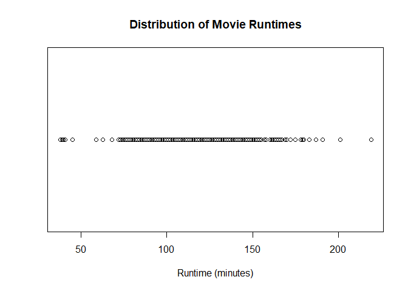
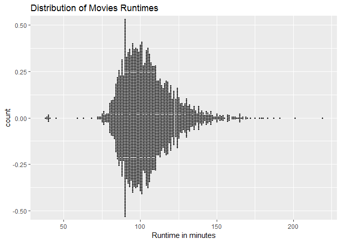

# Dot Plot

## Highlights

* Location - Shows location and distribution
* Simple - Show few data, for instance: min/max and where are located the most of the observations
* Small size

## Help us Answer Questions like:

1. What is the average movie runtime?
2. Are there any outliers?
3. How spread out are the movie runtimes?
4. What is the shape of the runtime distribution?

## Core R Library

### Setup environment


```r
movies = read.csv("../data/Movies.csv")
```

Create a dot plot of runtime

```r
plot(
  x = movies$Runtime,
  y = rep(0, nrow(movies)),
  main = "Distribution of Movie Runtimes",
  xlab = "Runtime (minutes)",
  ylab = "",
  yaxt = "n"
)
```



Creating the same previous plot, but now with alpha

```r
plot(
  x = movies$Runtime,
  y = rep(0, nrow(movies)),
  main = "Distribution of Movie Runtime",
  xlab = "Runtime (minutes)",
  ylab = "",
  yaxt = "n",
  pch = 16,
  col = rgb(0,0,0,0.1))
```


## Lattice Library


Create dot plot for runtime

```r
stripplot(
  x = ~Runtime,
  data = movies,
  main = main_title,
  xlab = x_lab)
```


## GGPlot Library


``` r
ggplot(
  data = movies,
  aes(x=Runtime, stat= "Count")) +
  geom_dotplot(binwidth = 1) +
  ggtitle(main_title) + 
  xlab(x_lab)
```


### Violin-Style dot plot

``` r
ggplot(
  data = movies,
  aes(x = Runtime, stat = "count")) +
  geom_dotplot(
    binwidth = 1,
    stackdir = "center") +
  ggtitle(main_title) +
  xlab(x_lab)
```

