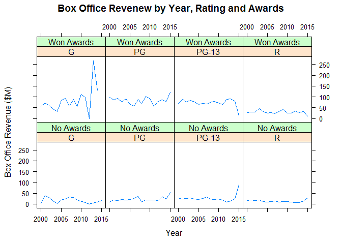
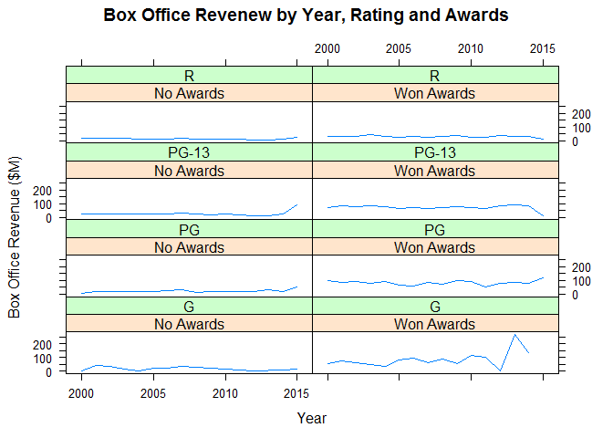
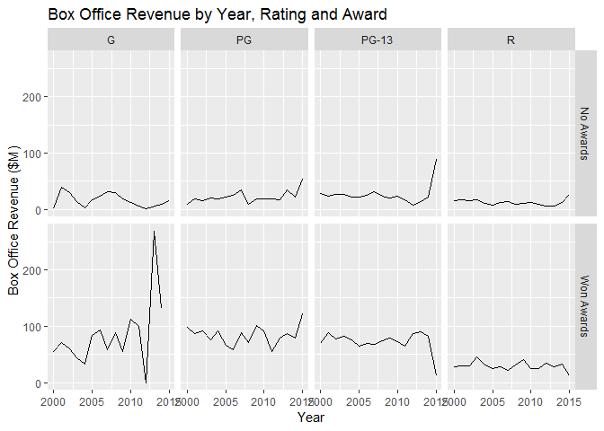
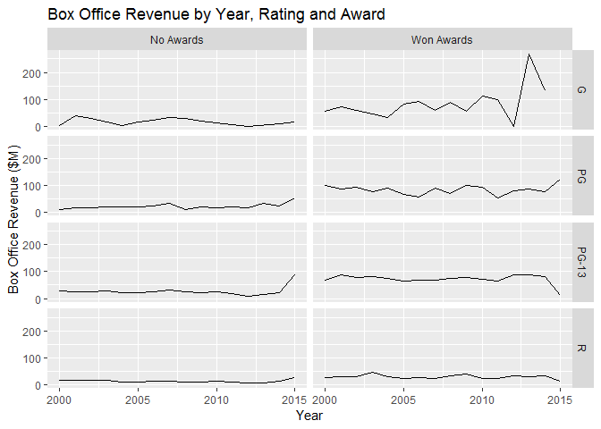

# 2D Facetted Grid

## Environment Setup

Load row-based time series

``` r
timeSeries3 <- read.csv("../data/TimeSeries3.csv")
head(timeSeries3)
```

    ##   Year Rating     Awards Box.Office
    ## 1 2000      G  No Awards    2.00000
    ## 2 2000      G Won Awards   54.96000
    ## 3 2000     PG  No Awards    9.00000
    ## 4 2000     PG Won Awards   98.53333
    ## 5 2000  PG-13  No Awards   28.00000
    ## 6 2000  PG-13 Won Awards   69.55357

## Lattice Library

**Horizontal**


``` r
title <- "Box Office Revenew by Year, Rating and Awards"

xyplot(
  x = Box.Office ~ Year | Rating * Awards,
  data = timeSeries3,
  type = "l",
  main = title,
  xlab = x_lab,
  ylab = y_lab)
```


**Vertical**

``` r
xyplot(
  data = timeSeries3,
  x = Box.Office ~ Year | Awards * Rating,
  type = "l",
  main = title,
  xlab = x_lab,
  ylab = y_lab)
```




## GGPlot Library

**Horizontal**

``` r
title <- "Box Office Revenue by Year, Rating and Award"
timeSeries3 = read.csv("../data/TimeSeries3.csv")

ggplot(
  data = timeSeries3,
  aes(x = Year, y = Box.Office)) +
  geom_line() +
  ggtitle(title) +
  xlab(x_lab) +
  ylab(y_lab) +
  facet_grid(facets = Awards ~ Rating)
```



**Vertical**

``` r
ggplot(
  data = timeSeries3,
  aes(x = Year, y = Box.Office)) +
  geom_line() +
  ggtitle(title)+
  xlab(x_lab) +
  ylab(y_lab) +
  facet_grid(facets = Rating ~ Awards )
```

