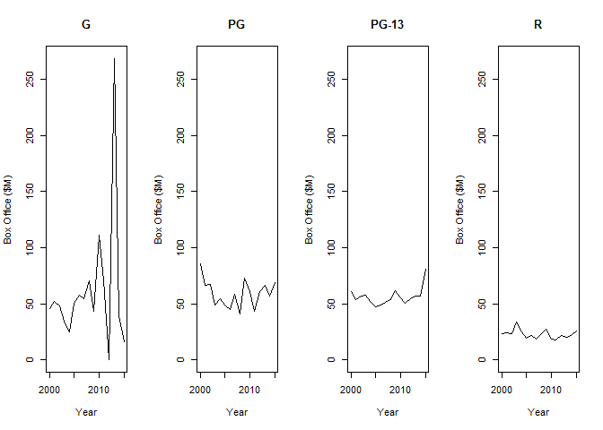
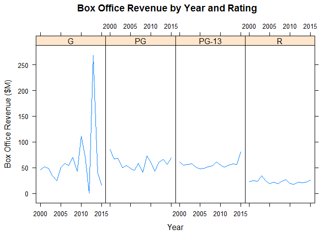
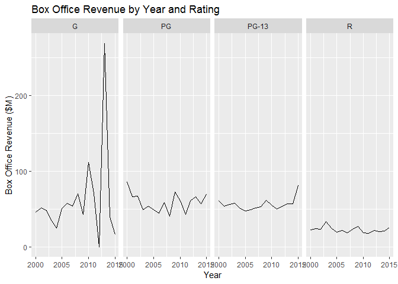

# Horizontal Facet

## Environment Setup

``` r
timeSeries <- read.csv("../data/TimeSeries.csv")
head(timeSeries)
```

    ##   Year        G       PG     PG13        R
    ## 1 2000 46.13333 85.74286 61.24286 23.07253
    ## 2 2001 51.82000 66.84118 54.15153 24.48450
    ## 3 2002 48.45000 67.62500 56.59665 23.52896
    ## 4 2003 34.31667 49.37539 57.77350 33.98456
    ## 5 2004 24.85000 54.30493 51.19265 24.96031
    ## 6 2005 50.60000 49.02735 47.63012 19.35382

``` r
#Create parameterized function to plot line chart
plotFacet <- function(index, name){
  values <- timeSeries[,c(1,index)]
  yMax <- max(timeSeries$G)
  plot(
    x = values,
    type = "l",
    ylim = c(0,yMax),
    main = name,
    xlab = "Year",
    ylab = "Box Office ($M)")
}
```

## Core R Library


Create horizontal facets

``` r
par(mfrow = c(1,4))

plotFacet(2,"G")
plotFacet(3,"PG")
plotFacet(4,"PG-13")
plotFacet(5,"R")
```



## Lattice Library


``` r
title <- "Box Office Revenue by Year and Rating"
x_lab <- "Year"
y_lab <- "Box Office Revenue ($M)"


xyplot(
  data = timeSeries2,
  x = Box.Office ~ Year | Rating,
  type = "l",
  layout = c(4,1),
  main = title,
  xlab=x_lab,
  ylab = y_lab)
```



## GGPlot Library


``` r
ggplot(
  data = timeSeries2,
  aes(x=Year,y=Box.Office)) +
  geom_line()+
  facet_grid(
    facets = .~Rating) + # Rows ~ Columns
  ggtitle(title) +
  xlab(x_lab) +
  ylab(y_lab) 
```


