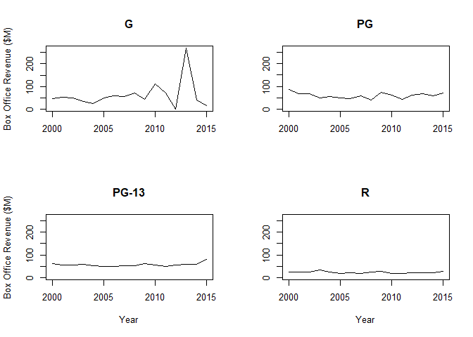
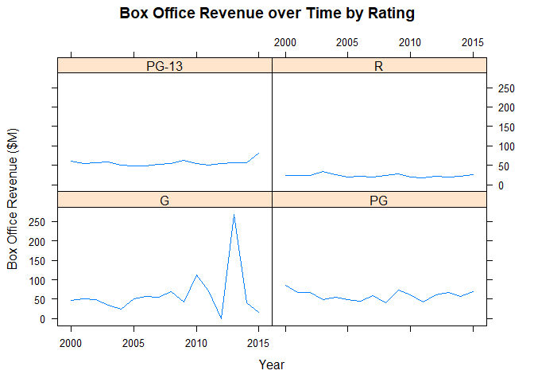
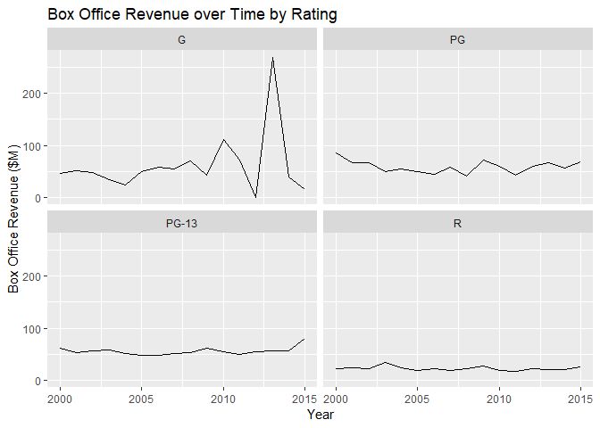

# Faceted Area Chart

## Highlights

* Line chart
* Faceted
* Compare overall shape

## Core R Library


``` r
par(mfrow = c(2,2))
ymax <-  max(timeSeries$G)
plot(
  x = timeSeries[,c(1,2)],
  type = "l",
  main = "G",
  xlab = "",
  ylab = "Box Office Revenue ($M)")

plot(
  x = timeSeries[,c(1,3)],
  type = "l",
  main = "PG",
  xlab = "",
  ylab = "",
  ylim = c(0, ymax))

plot(
  x = timeSeries[,c(1,4)],
  type = "l",
  main = "PG-13",
  xlab = "Year",
  ylab = "Box Office Revenue ($M)",
  ylim = c(0,ymax))

plot(
  x = timeSeries[,c(1,5)],
  type = "l",
  main = "R",
  xlab = "Year",
  ylab = "",
  ylim = c(0,ymax))
```



## Lattice Library

``` r
xyplot(
  x = Box.Office ~ Year | Rating,
  data = timeSeries2,
  type = "l",
  layout = c(2,2),
  main = "Box Office Revenue over Time by Rating",
  xlab = "Year",
  ylab = "Box Office Revenue ($M)")
```




## GGPlot Library

``` r
timeSeries2 %>%
  ggplot(
    aes(
      x = Year,
      y = Box.Office)) +
  geom_line() +
  facet_wrap(
    facets = ~Rating) +
  ggtitle("Box Office Revenue over Time by Rating") +
  xlab("Year") +
  ylab("Box Office Revenue ($M)")
```

