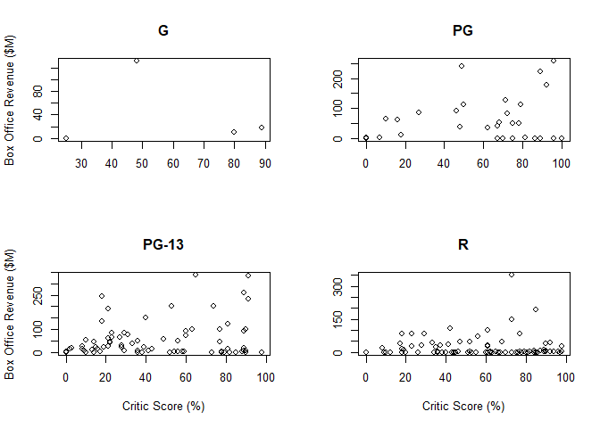
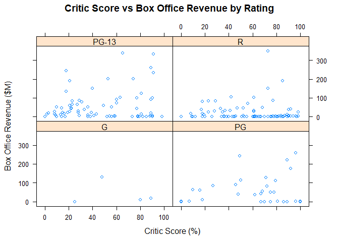
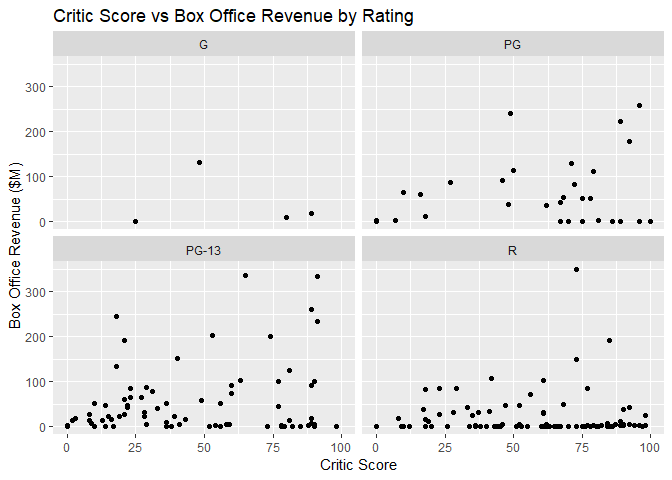

# Faceted Scatted Plot

## Highlights

* Scatterplot
* Faceted
* Compare overall shape

## Environment Setup

``` r
library(RColorBrewer)
```

    ## Warning: package 'RColorBrewer' was built under R version 3.5.2

``` r
movies2014 <- read.csv("../data/movies.csv")
movies2014 <- movies2014[movies2014$Year == 2014,]

colors <- brewer.pal(4, "Set1")
```

## Core R Library

We need to create the tables first

``` r
gMovies <- movies2014[movies2014$Rating == "G",]
pgMovies <- movies2014[movies2014$Rating == "PG",]
pg13Movies <- movies2014[movies2014$Rating == "PG-13",]
rMovies <- movies2014[movies2014$Rating == "R",]
```

``` r
par(mfrow = c(2,2))

plot(
  x = gMovies$Critic.Score,
  y = gMovies$Box.Office,
  main = "G",
  xlab = "",
  ylab = "Box Office Revenue ($M)")

plot(
  x = pgMovies$Critic.Score,
  y = pgMovies$Box.Office,
  main = "PG",
  xlab = "",
  ylab = "")

plot(
  x = pg13Movies$Critic.Score,
  y = pg13Movies$Box.Office,
  main = "PG-13",
  xlab = "Critic Score (%)",
  ylab = "Box Office Revenue ($M)")

plot(
  x = rMovies$Critic.Score,
  y = rMovies$Box.Office,
  main = "R",
  xlab = "Critic Score (%)",
  ylab = "")
```



## Lattice Library

``` r
movies2014 %>%
  xyplot(
    x = Box.Office ~ Critic.Score | Rating,
    main = "Critic Score vs Box Office Revenue by Rating",
    xlab = "Critic Score (%)",
    ylab = "Box Office Revenue ($M)")
```



## GGPlot Library

``` r
movies2014 %>%
  ggplot(
    aes(x = Critic.Score, 
        y = Box.Office)) +
  geom_point() +
  facet_wrap(
    facets =  ~Rating) +
  ggtitle("Critic Score vs Box Office Revenue by Rating") +
  xlab("Critic Score") +
  ylab("Box Office Revenue ($M)")
```

