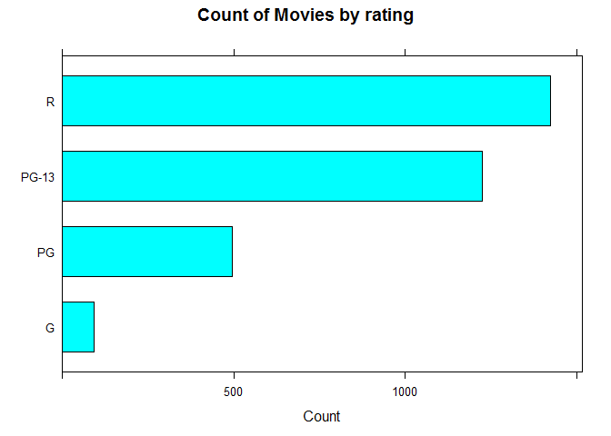

# Frequency Bar Chart


## Setup the environment

Set working directory (no needed if working on R project)
`setwd("path")`

Load movie data from CSV file

``` r
movies <- read.csv("../data/Movies.csv")
```

Peek at the data

``` r
head(movies)
```

    ##                              Title Year Rating Runtime Critic.Score
    ## 1             The Whole Nine Yards 2000      R      98           45
    ## 2 Cirque du Soleil: Journey of Man 2000      G      39           45
    ## 3                        Gladiator 2000      R     155           76
    ## 4                         Dinosaur 2000     PG      82           65
    ## 5                Big Momma's House 2000  PG-13      99           30
    ## 6            Gone in Sixty Seconds 2000  PG-13     118           24
    ##   Box.Office Awards International
    ## 1       57.3  FALSE         FALSE
    ## 2       13.4   TRUE         FALSE
    ## 3      187.3   TRUE          TRUE
    ## 4      135.6   TRUE         FALSE
    ## 5        0.5   TRUE          TRUE
    ## 6      101.0   TRUE         FALSE

## Univariate visualization for a qualitative variable


### Core R library

Create a frequency bar chart of ratings, *the chart internally resolve to display data as bar chart*

``` r
plot(
  x = movies$Rating,
  main = "Count of Movies by Rating",
  xlab = "Raiting",
  ylab = "Count of Movies"
)
```


Create a horizontal frecuency chart of ratings

``` r
plot(
  x= movies$Rating,
  horiz = TRUE,
  main ="Count of Movies by Rating",
  xlab = "Count of Movies",
  ylab = "Rating"
)
```


### Lattice Library - R

Create frequency table of ratings

``` r
table <- table(movies$Rating)
ratings <- as.data.frame(table)
names(ratings)[1] <- "Rating"
names(ratings)[2] <- "Count"

print(ratings)
```

    ##   Rating Count
    ## 1      G    93
    ## 2     PG   497
    ## 3  PG-13  1225
    ## 4      R  1423


Create a frequency bar chart

``` r
barchart(
  x= Count ~ Rating,
  data = ratings,
  main = "Count of Movies by rating",
  xlab = "Rating"
)
```


Create a horizontal bar chart

``` r
barchart(
  x = Rating ~ Count,
  data = ratings,
  main = "Count of Movies by rating",
  xlab = "Count"
)
```



### GGPlot Library - R


Create a frequency bar chart for rating

``` r
ggplot(
  data = movies,
  aes(x = Rating)) +
  geom_bar() +
  ggtitle("Count of Movies Rating")
```


Create a horizontal frequency bar chart for genre

``` r
ggplot(
  data= movies,
  aes(x = Rating)) + 
  geom_bar() +
  coord_flip() +
  ggtitle("Count of Movies by Rating")
```


