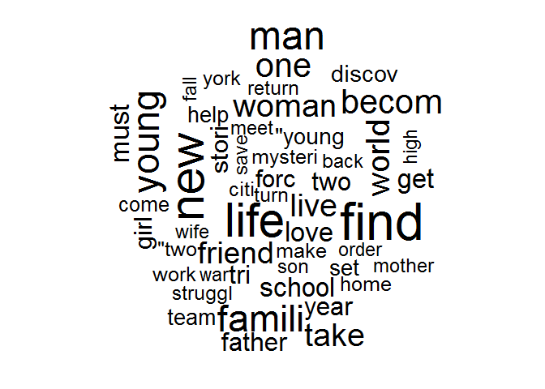

# Frequency Word Cloud

## Highlights

* Visualization of terms
* Size by frequency
* Random or ordered


## Environment Setup - Text Mining, Snow Ball, Word Cloud & RColorBrewer Libraries


``` r
library(tm) # text mining package
library(SnowballC)
library(wordcloud)
library(RColorBrewer)

plots <- read.csv("../data/Plots.csv")
plots$Plot <- as.character(plots$Plot)
head(plots$Plot, 3)
```

    ## [1] "Nick is a struggling dentist in Canada. A new neighbor moves in, and he discovers that it is Jimmy \"The Tulip\" Teduski. His wife convinces him to go to Chicago and inform the mob boss who wants Jimmy dead."
    ## [2] "A child is born. We see underwater swimmers representing this. He is young, in a jungle setting, with two fanciful \"instincts\" guiding him as swooping bird-like acrobats initially menace, ..."              
    ## [3] "When a Roman general is betrayed and his family murdered by an emperor's corrupt son, he comes to Rome as a gladiator to seek revenge."

> Convert plots into corpus

``` r
corpus <- Corpus(VectorSource(plots$Plot))
corpus[[1]]$content
```

    ## [1] "Nick is a struggling dentist in Canada. A new neighbor moves in, and he discovers that it is Jimmy \"The Tulip\" Teduski. His wife convinces him to go to Chicago and inform the mob boss who wants Jimmy dead."

> Convert text to lower case

``` r
corpus <- tm_map(corpus, content_transformer(tolower))
```

> Remove punctuation

``` r
corpus <- tm_map(corpus, removePunctuation)
```

> Remove stop words from corpus

``` r
corpus <- tm_map(corpus, removeWords, stopwords("english"))
```

> Reduce terms to stems in corpus

``` r
corpus <- tm_map(corpus, stemDocument, "english")
```

> Strip whitespace from corpus

``` r
corpus <- tm_map(corpus, stripWhitespace)
```

> Convert corpus to text document

``` r
corpus <- tm_map(corpus, PlainTextDocument)
```

> Taking a look at the current result

``` r
head(corpus[[1]]$content)
```

    ## [1] "nick struggl dentist canada new neighbor move discov jimmi tulip teduski wife convinc go chicago inform mob boss want jimmi dead"
    ## [2] "child born see underwat swimmer repres young jungl set two fanci instinct guid swoop birdlik acrobat initi menac"                
    ## [3] "roman general betray famili murder emperor corrupt son come rome gladiat seek reveng"                                            
    ## [4] "orphan dinosaur rais lemur join arduous trek sancturari meteorit shower destroy famili home"                                     
    ## [5] "fbi agent disguis old ladi protect beauti feder wit son"                                                                         
    ## [6] "retir master car thief must come back industri steal 50 car crew one night save brother life"


## Frequency Word Cloud


Create a frequency word cloud

``` r
wordcloud(
    words = corpus[1],
    max.words = 50)
```



