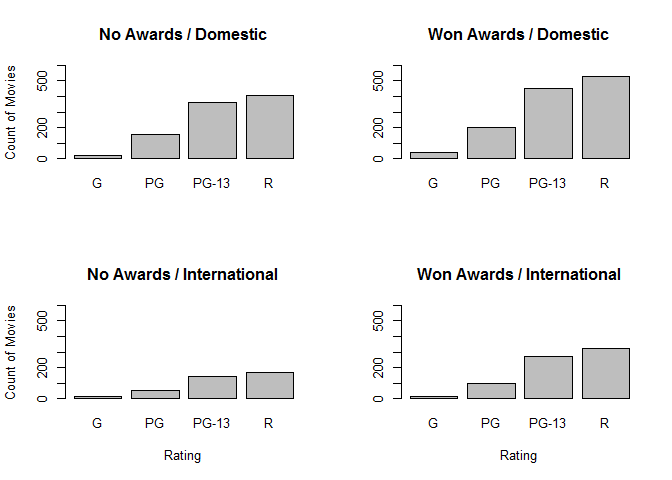
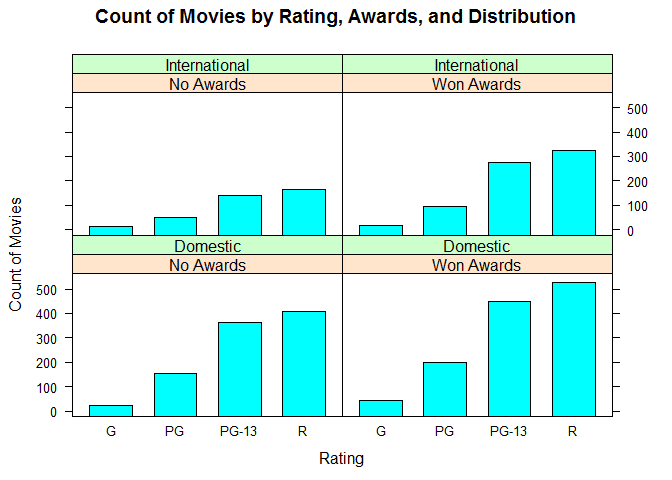
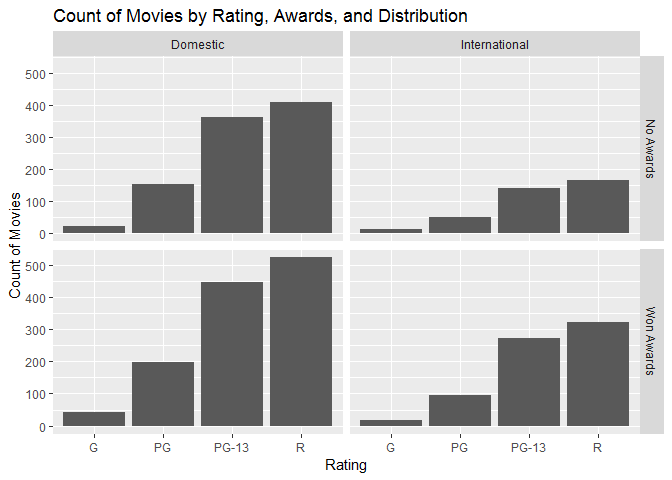

# Faceted Frequency Bar Chart

## Environment Setup

``` r
getTable2 <- function(awards, distribution){
  
  filter <- movies$Awards == awards & movies$Distribution == distribution
  subset <-movies[filter, ]
  table(subset$Rating)
}
```

Print frequency tables

``` r
getTable2("No Awards", "Domestic")
```

    ## 
    ##     G    PG PG-13     R 
    ##    22   153   361   408

``` r
getTable2("Won Awards","Domestic")
```

    ## 
    ##     G    PG PG-13     R 
    ##    43   198   449   526

``` r
getTable2("No Awards","International")
```

    ## 
    ##     G    PG PG-13     R 
    ##    12    50   141   166

``` r
getTable2("Won Awards","International")
```

    ## 
    ##     G    PG PG-13     R 
    ##    16    96   274   323


## Core R Library

``` r
par(mfrow = c(2,2))

barplot(
  height = getTable2("No Awards", "Domestic"),
  ylim = c(0,600),
  main = "No Awards / Domestic",
  ylab = "Count of Movies")


barplot(
  height = getTable2("Won Awards", "Domestic"),
  ylim = c(0,600),
  main = "Won Awards / Domestic")


barplot(
  height = getTable2("No Awards", "International"),
  ylim = c(0,600),
  main = "No Awards / International",
  ylab = "Count of Movies",
  xlab = "Rating")


barplot(
  height = getTable2("Won Awards", "International"),
  ylim = c(0,600),
  main = "Won Awards / International",
  xlab = "Rating")
```



``` r
par(mfrow= c(1,1)) # Reset the default behavior
```

## Lattice Library

``` r
table %>%
  barchart( 
    x = Count ~ Rating | Awards * Distribution,
    main = "Count of Movies by Rating, Awards, and Distribution",
    xlab = "Rating",
    ylab = "Count of Movies",
    auto.key = TRUE) # Let Lattice to generate the legend.
```




## GGPlot Library


``` r
movies %>%
  ggplot(aes(x = Rating)) +
  geom_bar() +
  facet_grid(
    facets = Awards ~ Distribution) +
  ggtitle("Count of Movies by Rating, Awards, and Distribution")+
  xlab("Rating")+
  ylab("Count of Movies")
```


