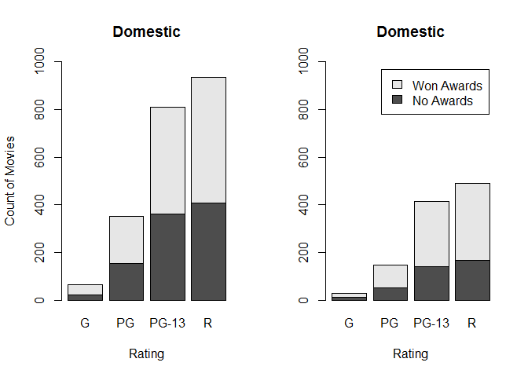
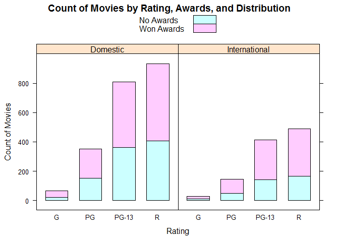
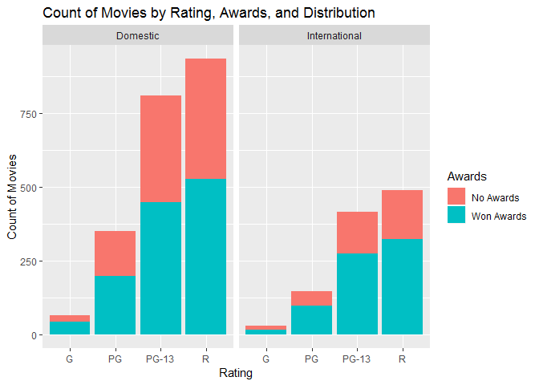

# Faceted Stacked Frequency Bar Chart

## Environment Setup

``` r
movies <- read.csv("../data/movies.csv")
head(movies)
```

    ##                   Title Year Rating Runtime Critic.Score Box.Office
    ## 1  The Whole Nine Yards 2000      R      98           45       57.3
    ## 2      Cirque du Soleil 2000      G      39           45       13.4
    ## 3             Gladiator 2000      R     155           76      187.3
    ## 4              Dinosaur 2000     PG      82           65      135.6
    ## 5     Big Momma's House 2000  PG-13      99           30        0.5
    ## 6 Gone in Sixty Seconds 2000  PG-13     118           24      101.0
    ##       Awards  Distribution
    ## 1  No Awards      Domestic
    ## 2 Won Awards      Domestic
    ## 3 Won Awards International
    ## 4 Won Awards      Domestic
    ## 5 Won Awards International
    ## 6 Won Awards      Domestic

Function to creat Contingency tables

``` r
getTable <- function(distribution){
  filter <- movies$Distribution == distribution
  subset <- movies[filter,]
  table(
    x = subset$Awards,
    y = subset$Rating)
}
```

Displaying contingency tables

``` r
getTable("Domestic")
```

    ##             y
    ## x              G  PG PG-13   R
    ##   No Awards   22 153   361 408
    ##   Won Awards  43 198   449 526

``` r
getTable("International")
```

    ##             y
    ## x              G  PG PG-13   R
    ##   No Awards   12  50   141 166
    ##   Won Awards  16  96   274 323

## Core R Library

``` r
par(mfrow = c(1,2))
barplot(
  height = getTable("Domestic"),
  beside = FALSE, # Default
  ylim = c(0,1000),
  main = domestic_axes_title,
  xlab = rating_axes_title,
  ylab = count_movies_axes_title)

barplot(
  height = getTable("International"),
  ylim = c(0,1000),
  beside = FALSE, # Default
  main = domestic_axes_title,
  xlab = rating_axes_title,
  legend = rownames(getTable("International")))
```



## Lattice Library


``` r
table %>%
  barchart(
    x = Count ~ Rating | Distribution,
    groups = Awards,
    stack = TRUE,
    main = "Count of Movies by Rating, Awards, and Distribution",
    xlab = "Rating",
    ylab = "Count of Movies",
    auto.key = TRUE) # Let Lattice to generate the legend.
```



## GGPlot Library


``` r
movies %>%
  ggplot(
    aes(x = Rating, fill = Awards)) +
  geom_bar() +
  facet_wrap(
    facets = ~Distribution) +
  ggtitle("Count of Movies by Rating, Awards, and Distribution")+
  xlab("Rating")+
  ylab("Count of Movies")
```

