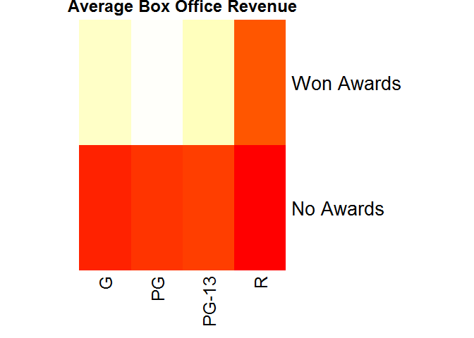

# Heat Map

Chart for 2 Qualitative and 1 Quantitative variables

## Highlights

* Visual matrix
* Color-coded cells
* Visual patterns

## Environment Setup

Function to create table rows

``` r
library(tidyverse)
```

    ## Warning: package 'tidyverse' was built under R version 3.5.2

    ## -- Attaching packages ------------------------------------------------------------------------ tidyverse 1.2.1 --

    ## v ggplot2 3.0.0     v purrr   0.2.5
    ## v tibble  1.4.2     v dplyr   0.7.6
    ## v tidyr   0.8.1     v stringr 1.3.1
    ## v readr   1.1.1     v forcats 0.3.0

    ## -- Conflicts --------------------------------------------------------------------------- tidyverse_conflicts() --
    ## x dplyr::filter() masks stats::filter()
    ## x dplyr::lag()    masks stats::lag()

``` r
movies <- read.csv("../data/movies.csv")
no_awards <- "No Awards"
won_awards <- "Won Awards"

getRow <- function(awards){
  
  subset <- movies[movies$Awards == awards,]
  
  tapply(
    subset$Box.Office,
    subset$Rating,
    mean)
}

# Combine the two rows to form a table

table <- rbind(
  getRow(no_awards),
  getRow(won_awards))

# Rename the rows
rownames(table) = c(no_awards, won_awards)

print(table)
```

    ##                   G       PG    PG-13        R
    ## No Awards  19.15958 22.41607 24.42359 11.82556
    ## Won Awards 76.40349 79.87252 75.48686 29.31659

## Core R Library

``` r
heatmap(
  x = table,
  col = heat.colors(100),
  scale = "none",
  Colv = NA,
  Rowv = NA,
  margins = c(6,10),
  main = "Average Box Office Revenue",
  cexRow = 2)
```



## Lattice Library

``` r
levelplot(
  x = Box.Office ~ Rating * Awards,
  data = table2,
  main = "Average Box Office Revenue by Rating and Award Status",
  xlab = "Rating",
  ylab = "Box Office Revenue ($M)")
```


## GGPlot Library

``` r
table2 <- movies %>%
  select(Rating, Awards, Box.Office) %>%
  group_by(Rating, Awards) %>%
  summarize(Box.Office = mean(Box.Office))

table2 %>%
  ggplot(aes(x = Rating, y = Awards, fill= Box.Office)) +
  geom_tile(stat = "identity") +
  ggtitle("Average Box Office Revenue by Rating and Award Status") +
  xlab("Rating") +
  ylab("Awards") +
  labs(fill = "Box Office\nRevenue ($M)")
```

