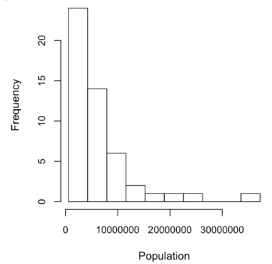
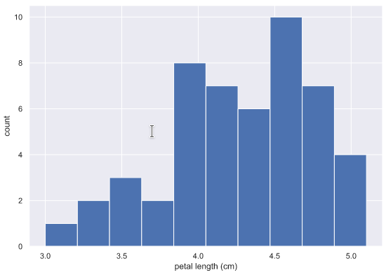
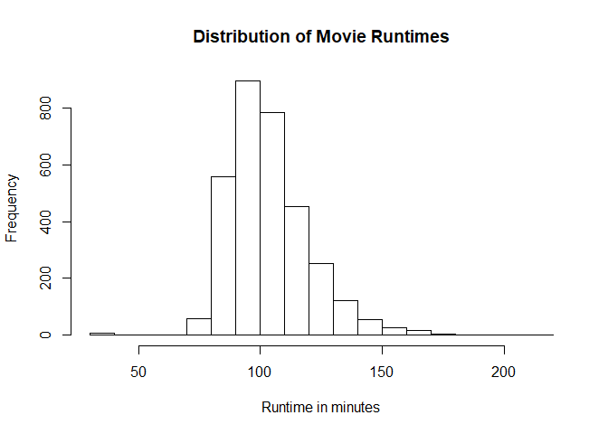
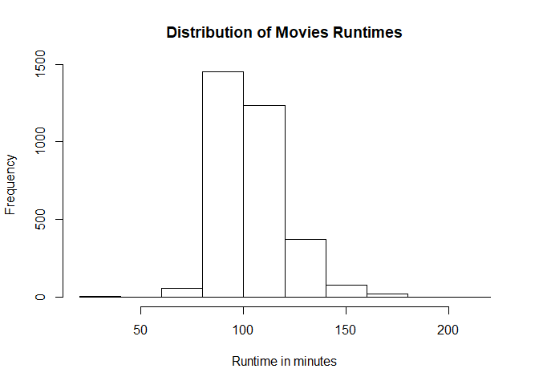
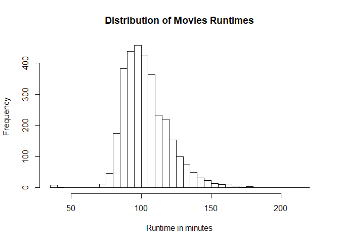
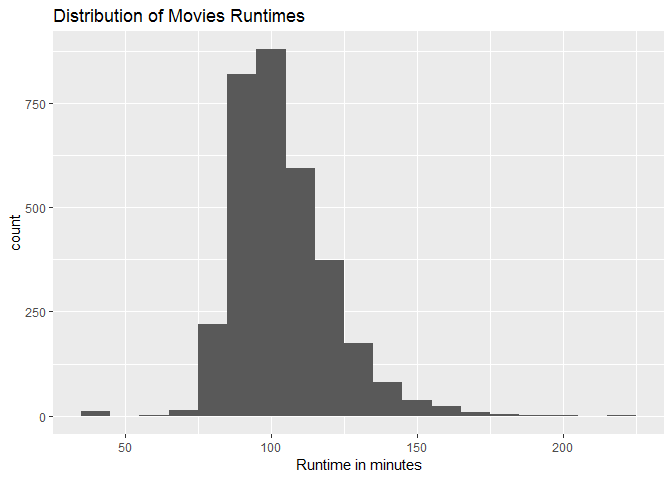

# Histograms




## Description

> A diagram consisting of rectangles whose area is proportional to the frequency of a variable and whose width is equal to the class interval.

## Highlights

  * Shows distribution of values by grouping them in **bins**
    * Number of bins is important, a default value is 10. 
    * Choosing too many or too few bins can affect the way you see the data
    * A rule for choosing the number of bins is to use the **square root of the number of samples**
  * Location
  * Shape of data  

## Matplotlib - Python

Python Code snipet to set number of bins based on the edges

```python
bin_edges = [0,10,20,30,40,50,60,70,80,90,100]
plt.hist(df["column"], bins=bin_edges)
```

Python Code snipet to set number of bins based on the edges

```python
plt.hist(df["column"], bins=10)
```

## Matplotlib & Seaborn Libraries - Python

Seaborn has plots and predefined themes.

```python
import matplotlib.pyplot as plt
import seaborn as sns

sns.set()
_ = plt.hist(df["variable"])
_ = plt.xlabel("X axis label")
_ = plt.ylabel("Y axis label")
plt.show()
```




## Environment Setup for R

``` r
movies = read.csv("../data/Movies.csv")
```

## Core R Library

``` r
hist(
  x = movies$Runtime,
  main= "Distribution of Movie Runtimes",
  xlab = "Runtime in minutes"
)
```



Creating a more course-grain histogram

``` r
hist(
  x= movies$Runtime,
  main = "Distribution of Movies Runtimes",
  breaks = 10,
  xlab = "Runtime in minutes"
)
```



Creating a more fine-grain histogram

``` r
hist(
  x = movies$Runtime,
  main = "Distribution of Movies Runtimes",
  breaks = 30,
  xlab = "Runtime in minutes"
)
```



## Lattice Library

``` r
histogram(
  x = ~Runtime,
  data = movies,
  main = main_title,
  xlab = x_lab)
```


## GGPlot Library


``` r
ggplot(
data = movies,
aes(x = Runtime)) +
geom_histogram(binwidth = 10) +
  ggtitle(main_title) + 
  xlab(x_lab)
```

