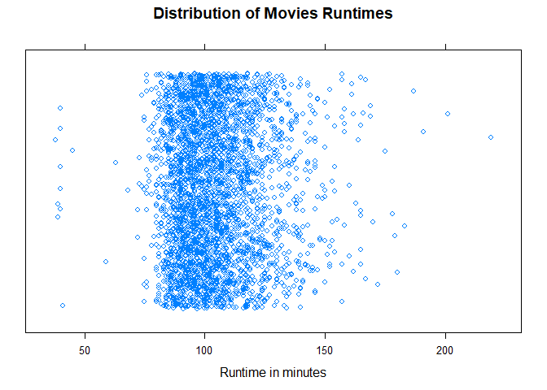

# Jitter Plot

## Highlights

* Contains the same data of the dot plot
* Uses empty circles and jitter
    + Jitter is noise that is used to avoid points overlapping, so they are spread alog y-axis just to show the samples
* Large sample size
* Discrete values


## We Can Answer Questions like

  1. What is the average movie runtime?
  2. Are there any outliers?
  3. How spread out are the movie runtimes?
  4. What is the shape of the runtime distribution?


## Setting up environment


```r
movies = read.csv("../data/Movies.csv")
```


```r
plot(
  x = movies$Runtime,
  y= jitter(rep(0,nrow(movies))),
  main = "Distribution of Movie Runtimes",
  xlab = "Runtime in minutes",
  ylab = "",
  yaxt = "n")
```


## Jitter Library


``` r
stripplot(
  x = ~Runtime,
  data = movies,
  main = main_title,
  xlab = x_lab,
  jitter = TRUE,
  amount = 0.5
)
```



## GGPlot Library

There is not any, at least by the time I was taking the course.
