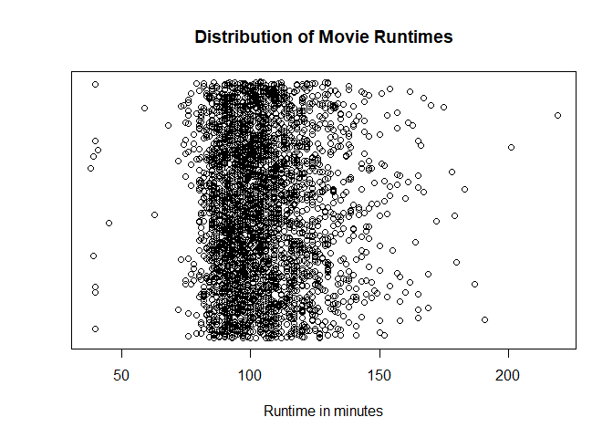

# Jitter Plot

## Highlights

* Contains the same data of the dot plot
* Uses empty circles and jitter
    + Jitter is noise that is used to avoid points overlapping, so they are spread alog y-axis just to show the samples
* Large sample size
* Discrete values


## Setting up environment

```r
movies = read.csv("../data/Movies.csv")
```


```r
plot(
  x = movies$Runtime,
  y= jitter(rep(0,nrow(movies))),
  main = "Distribution of Movie Runtimes",
  xlab = "Runtime in minutes",
  ylab = "",
  yaxt = "n")
```



## Jitter Library


``` r
stripplot(
  x = ~Runtime,
  data = movies,
  main = main_title,
  xlab = x_lab,
  jitter = TRUE,
  amount = 0.5
)
```


## GGPlot Library

There is not any, at least by the time I was taking the course.
