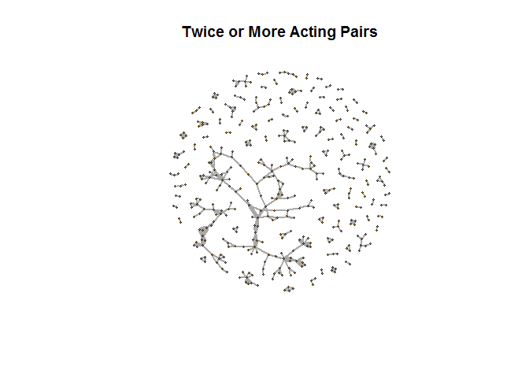

# Large Graph

## Highlights

* Shape and patterns
* Minimize noise
* Additional variables
  
## Environment Setup 

### IGraph Library


``` r
library(igraph)

actors <- read.csv("../data/Actors.csv")
head(actors)
```

    ##     Actor                  Partner Count
    ## 1 50 Cent Adewale Akinnuoye-Agbaje     1
    ## 2 50 Cent                Al Pacino     1
    ## 3 50 Cent             Carla Gugino     1
    ## 4 50 Cent               Joy Bryant     1
    ## 5 50 Cent       Omar Benson Miller     1
    ## 6 50 Cent           Robert De Niro     1

``` r
actors5 <- actors[actors$Count >= 5,]

graph5 <- graph.data.frame(
  d = actors5,
  directed = FALSE)
```

### Create undirected graph object

``` r
actors2 <- actors[actors$Count >= 2,]

graph2 <- graph.data.frame(
  d = actors2,
  directed  = FALSE)
```

``` r
plot(
  x = graph2,
  vertex.size = 2,
  vertex.label = NA,
  edge.curved = FALSE,
  edge.width = edge_attr(graph2)$Count,
  main = "Twice or More Acting Pairs")
```


