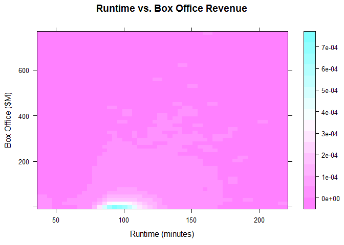

# Level Plot


This is similar to Countour plot, but color is added

## It Measures

* Colored levels
* Lower data-to-ink

## MASS Package

It requires [MASS package](mass_package.md)

## Environment Setup

``` r
movies <- read.csv('../data/Movies.csv')
main_label <- "Runtime vs. Box Office Revenue"
runtime_in_minutes_label <- "Runtime (minutes)"
box_office_label <- "Box Office ($M)"
density_label <- "Density"
```


## Core R Library

Create a level plot of density, please note that this is not exactly the expected plot, but it close enough in the base library.

It is like density heatmap.

``` r
image(x = density2d$x,
      y = density2d$y,
      z = density2d$z,
      col =topo.colors(100),
      main = main_label,
      xlab = runtime_in_minutes_label,
      ylab = box_office_label)
```


## Lattice Library


``` r
levelplot(
  x = z ~ x * y,
  data = grid,
  main = main_label,
  xlab = runtime_in_minutes_label,
  ylab = box_office_label)
```



## GGPlot Library


``` r
ggplot(
  data = movies,
  aes(x = Runtime, y = Box.Office)) +
  stat_density2d(aes(fill = ..level..), geom = "polygon") +
  ggtitle(main_label) +
  xlab(runtime_in_minutes_label) +
  ylab(box_office_label)
```


**Note:** *3D visualizations do not exist in ggplot*