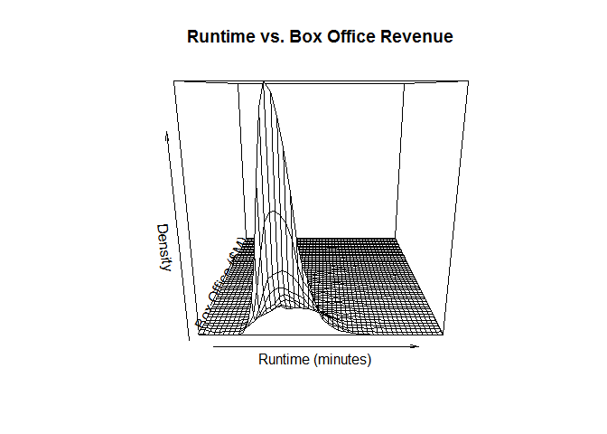
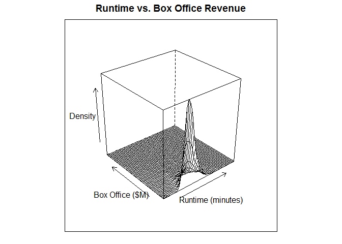

# Mesh Plot

This is a 3D of the joint density distribution of two quantitative variable

## It Measures

* Drape with mesh
* Pros & Cons
    - Allows to see the elevation at any point
    - The previous point sometimes add complexity to see aditional data depending of the perspective
    - Keep in mind audience for using this.


## MASS Package

It requires [MASS package](mass_package.md)

## Environment Setup

``` r
movies <- read.csv('../data/Movies.csv')
main_label <- "Runtime vs. Box Office Revenue"
runtime_in_minutes_label <- "Runtime (minutes)"
box_office_label <- "Box Office ($M)"
density_label <- "Density"
```

## Core R Library


``` r
persp(
  x = density2d$x,
  y = density2d$y,
  z = density2d$z,
  main = main_label,
  xlab = runtime_in_minutes_label,
  ylab = box_office_label,
  zlab = density_label)
```




## Lattice Library


``` r
wireframe(
  x = z ~ x * y,
  data = grid,
  main = main_label,
  xlab = runtime_in_minutes_label,
  ylab = box_office_label,
  zlab = density_label)
```



