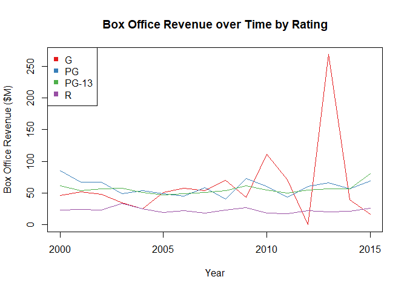
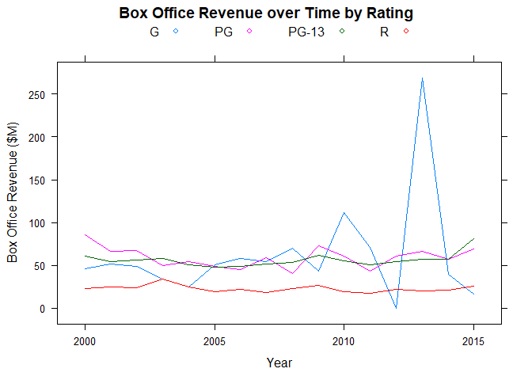
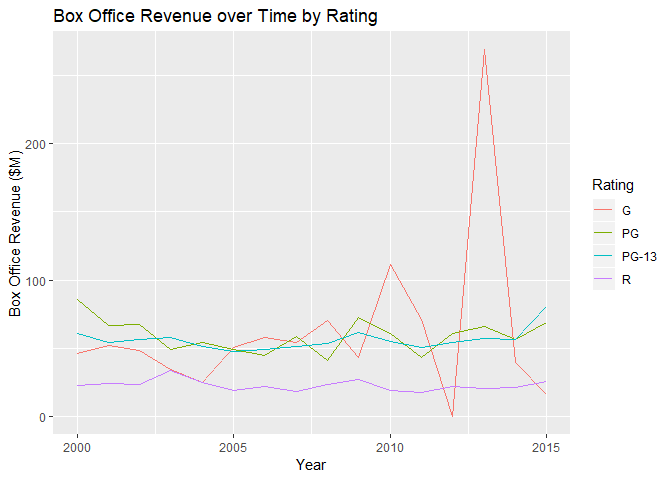

# Multi-Series Line Chart

## Highlights

* Line chart
* Multiple time series
* Easy comparisons

## Environment Setup


``` r
timeSeries <- read.csv("../data/TimeSeries.csv")
head(timeSeries)
```

    ##   Year        G       PG     PG13        R
    ## 1 2000 46.13333 85.74286 61.24286 23.07253
    ## 2 2001 51.82000 66.84118 54.15153 24.48450
    ## 3 2002 48.45000 67.62500 56.59665 23.52896
    ## 4 2003 34.31667 49.37539 57.77350 33.98456
    ## 5 2004 24.85000 54.30493 51.19265 24.96031
    ## 6 2005 50.60000 49.02735 47.63012 19.35382

## Core R Library

``` r
plot(
  x = 0,
  y = 0,
  xlim = c(2000,2015),
  ylim = c(0, max(timeSeries$G)),
  type = "l",
  main = "Box Office Revenue over Time by Rating",
  xlab = "Year",
  ylab = "Box Office Revenue ($M)")

lines(
  x = timeSeries$Year,
  y = timeSeries$G,
  col = colors[1])

lines(
  x = timeSeries$Year,
  y = timeSeries$PG,
  col = colors[2])

lines(
  x = timeSeries$Year,
  y = timeSeries$PG13,
  col = colors[3])

lines(
  x = timeSeries$Year,
  y = timeSeries$R,
  col = colors[4])

legend(
  x = "topleft",
  legend = c("G","PG","PG-13","R"),
  col = colors,
  pch = 15)
```




## Lattice Library


``` r
timeSeries2 <- movies %>%
  select(Year, Rating, Box.Office) %>%
  group_by(Year, Rating) %>%
  summarize(Box.Office = mean(Box.Office)) %>%
  as.data.frame()
head(timeSeries2)
```

    ##   Year Rating Box.Office
    ## 1 2000      G   46.13333
    ## 2 2000     PG   85.74286
    ## 3 2000  PG-13   61.24286
    ## 4 2000      R   23.07253
    ## 5 2001      G   51.82000
    ## 6 2001     PG   66.84118

Plotting

``` r
xyplot(
  x = Box.Office ~ Year,
  data = timeSeries2,
  groups =  Rating,
  type = "l",
  auto.key = list(columns = 4),
  main = "Box Office Revenue over Time by Rating",
  xlab = "Year",
  ylab = "Box Office Revenue ($M)")
```



## GGPlot Library

``` r
timeSeries2 <- movies %>%
  select(Year, Rating, Box.Office) %>%
  group_by(Year, Rating) %>%
  summarize(Box.Office = mean(Box.Office)) %>%
  as.data.frame()
head(timeSeries2)
```

    ##   Year Rating Box.Office
    ## 1 2000      G   46.13333
    ## 2 2000     PG   85.74286
    ## 3 2000  PG-13   61.24286
    ## 4 2000      R   23.07253
    ## 5 2001      G   51.82000
    ## 6 2001     PG   66.84118

``` r
timeSeries2 %>%
  ggplot(
    aes(
      x = Year,
      y = Box.Office,
      color = Rating)) +
  geom_line() +
  ggtitle("Box Office Revenue over Time by Rating") +
  xlab("Year") +
  ylab("Box Office Revenue ($M)")
```

