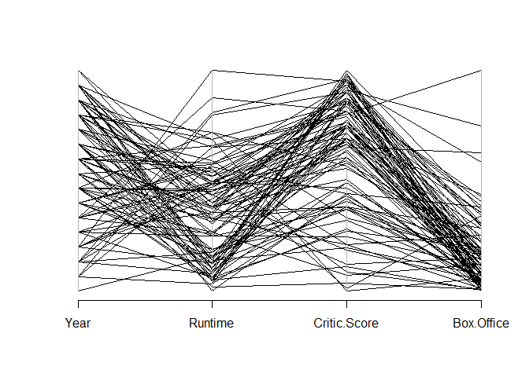
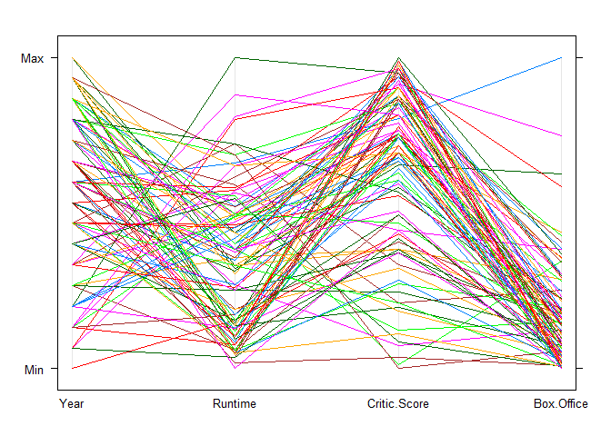
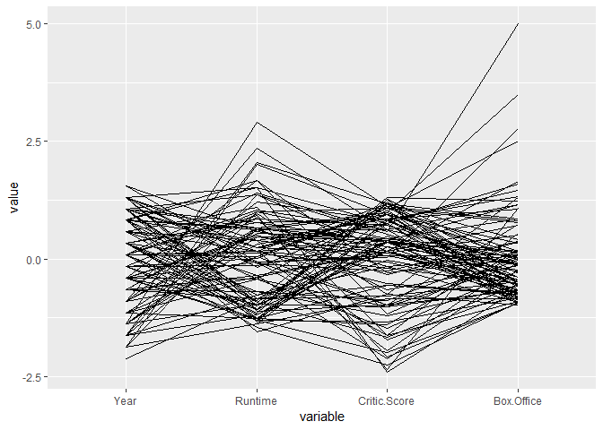

# Parallel Coordinates Plot

## Highlights

* Line chart
* Variables on x-axis
* Scaled values on y-axis

## Environment Setup

``` r
top100 <- read.csv("../data/Top 100.csv")
head(top100)
```

    ##                     Title Year Rating Runtime Critic.Score Box.Office
    ## 1                  Avatar 2009  PG-13     162           83      760.5
    ## 2            The Avengers 2012  PG-13     143           92      623.3
    ## 3          Jurassic World 2015  PG-13     124           71      556.5
    ## 4         The Dark Knight 2008  PG-13     152           94      533.3
    ## 5 Avengers: Age of Ultron 2015  PG-13     141           74      454.2
    ## 6   The Dark Knight Rises 2012  PG-13     165           87      448.1
    ##       Awards  Distribution
    ## 1 Won Awards International
    ## 2 Won Awards      Domestic
    ## 3  No Awards International
    ## 4 Won Awards International
    ## 5  No Awards      Domestic
    ## 6 Won Awards International

## Core R Library


``` r
library(MASS)
parcoord(top100[,c(2,4,5,6)])
```




## Lattice Library


``` r
parallelplot(
  x = top100[,c(2,4,5,6)],
  horizontal.axis = FALSE)
```




## GGPlot Library


``` r
ggparcoord(top100,c(2,4,5,6))
```

