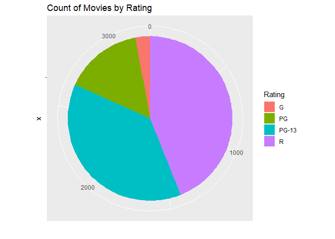

# Pie Chart

**This chart is not recommended** do to it is hard to see what size is bigger when values are close, the perspecticve may give an incorrect conclusion.

## Setup the environment

Set working directory (no needed if working on R project)
`setwd("path")`

Load movie data from CSV file

``` r
movies <- read.csv("../data/Movies.csv")
```

Peek at the data

``` r
head(movies)
```

    ##                              Title Year Rating Runtime Critic.Score
    ## 1             The Whole Nine Yards 2000      R      98           45
    ## 2 Cirque du Soleil: Journey of Man 2000      G      39           45
    ## 3                        Gladiator 2000      R     155           76
    ## 4                         Dinosaur 2000     PG      82           65
    ## 5                Big Momma's House 2000  PG-13      99           30
    ## 6            Gone in Sixty Seconds 2000  PG-13     118           24
    ##   Box.Office Awards International
    ## 1       57.3  FALSE         FALSE
    ## 2       13.4   TRUE         FALSE
    ## 3      187.3   TRUE          TRUE
    ## 4      135.6   TRUE         FALSE
    ## 5        0.5   TRUE          TRUE
    ## 6      101.0   TRUE         FALSE

## Univariate visualization for a qualitative variable

### Core R library

Create a Pie chart of ratings

``` r
pie(
  x = table(movies$Rating),
  main = "Count of Movies by Rating")
```


Create pie chart of awards

``` r
pie(
  x = table(movies$Awards),
  clockwise = TRUE,
  main="Proportion of Movies that Won Awards"
)
```


### GGPlot Library - R

``` r
ggplot(
  data = movies,
  aes(x="", fill = Rating)) + 
  geom_bar() + 
  coord_polar(theta = "y")+
  ggtitle("Count of Movies by Rating") +
  ylab("")
```



Create a pie chart of awards

``` r
ggplot(
  data=movies,
  aes(x="", fill=Awards)) +
  geom_bar() +
  coord_polar(theta = "y") +
  ggtitle("Proportion of  Movies that Won Awards") +
  ylab("")
```

