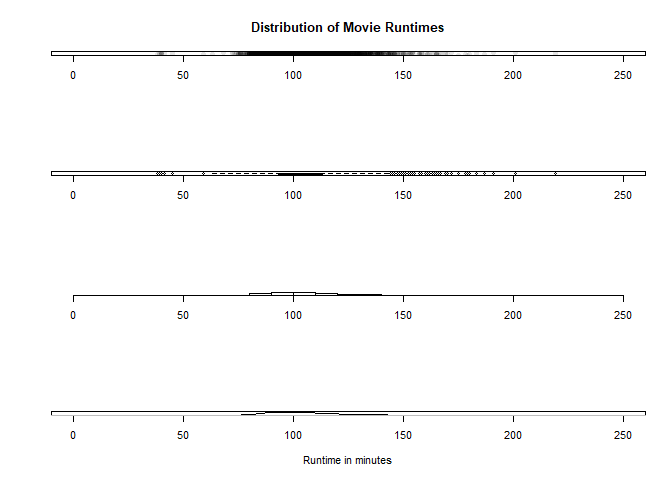
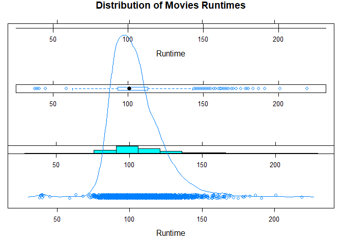
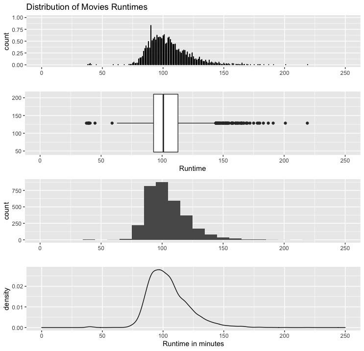

# Univariate Visualizations of a Quantitiative Variable - All in One


## Setup environment

``` r
movies = read.csv("../data/Movies.csv")
```

## Core R Library


``` r
par(mfrow= c(4,1))

plot(
  x= movies$Runtime,
  y = jitter(rep(0,nrow(movies))),
  xlim = c(0,250),
  main = "Distribution of Movie Runtimes",
  xlab = "",
  ylab = "",
  yaxt = "n",
  pch = 16,
  col = rgb(0,0,0,0.1))

boxplot(
  x = movies$Runtime,
  ylim= c(0,250),
  horizontal = TRUE
)

hist(
  x= movies$Runtime,
  xlim = c(0,250),
  main = "",
  xlab = "",
  ylab = "",
  yaxt = "n")

plot(
  x = density(movies$Runtime),
  xlim = c(0,250),
  main = "",
  xlab = "Runtime in minutes",
  ylab = "",
  yaxt = "n")
```



Then you can reset multirow display

``` r
par(mfrow = c(1,1))
```

## Lattice Library


Create small multiples of all four 

* **Note:** Not exactly lined up
* **Note 2:** this chart looks better in R script file, not well rendered here.

``` r
dot <- dotplot(
  x = ~Runtime,
  data = movies,
  main = main_title,
  x_lab = "")

print(
  x=dot,
  position = c(0,0.75,1,1),
  more = TRUE)

box <- bwplot(
  x= ~Runtime,
  data = movies,
  xlab = "")

print(
  x=box,
  position = c(0,0.5,1,0.75),
  more = TRUE)

hist <- histogram(
  x = ~Runtime,
  data =movies,
  xlab = "",
  ylab = "",
  scales = list(y = list(draw=FALSE)))

print(
  x = hist,
  position = c(0, 0.25, 1, 0.5),
  more = TRUE)


density <- densityplot(
  x= ~Runtime,
  data = movies,
  ylab = "",
  scales = list(y=list(draw = FALSE)))

print(
  x= density,
  postion = c(0,0,1,0.25))
```



## GGPlot Library


Plot small multiples of all four

``` r
while (!is.null(dev.list()))  dev.off()

library(grid)

viewport <- viewport(
  layout = grid.layout(4,1))

pushViewport(viewport)

dot <-ggplot(
  data = movies,
  aes(x = Runtime, ..count..)) +
  geom_dotplot(
    binwidth = 0.25) +
  scale_x_continuous(
    limits = c(0,250)) +
  ggtitle(main_title) +
  xlab("")

print(
  x = dot,
  vp = viewport(
    layout.pos.row = 1,
    layout.pos.col = 1))

box <- ggplot(
  data = movies,
  aes(x = Runtime, y = Runtime)) +
  geom_boxplot() +
  coord_flip() +
  scale_y_continuous(
    limits = c(0,250)) + 
  xlab("")

print(
  x = box,
  vp = viewport(
    layout.pos.row = 2,
    layout.pos.col = 1))

hist <- ggplot(
    data = movies, 
    aes(x = Runtime)) +
    geom_histogram(binwidth = 10) +
    scale_x_continuous(
        limits = c(0, 250)) +
    xlab("")

print(
  x = hist,
  vp = viewport(
    layout.pos.col = 1,
    layout.pos.row = 3)) 

density <- ggplot(
    data = movies, 
    aes(x = Runtime)) +
    geom_density() +
    scale_x_continuous(
        limits = c(0, 250)) +
    xlab(x_lab)

print(
  x = density,
  vp = viewport(
    layout.pos.col = 1,
    layout.pos.row = 4))
```

