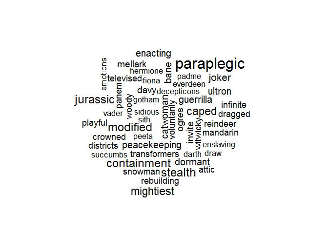

# Quantitative Word Cloud

## Highlights

* Sized by numeric variable
* Add a main chart title

## Environment Setup - Word Cloud Library


``` r
words <- read.csv("../data/Words.csv")
head(words, n=10)
```

    ##         Term Count Box.Office Critic.Score
    ## 1        aaa     1      31.00         6.00
    ## 2       aang     1     131.60         6.00
    ## 3      aaron     2      43.10        71.50
    ## 4      aback     1      25.80        13.00
    ## 5   abagnale     1     164.40        96.00
    ## 6    abandon     1      23.30        12.00
    ## 7  abandoned    10      52.97        53.70
    ## 8   abandons     3      26.07        68.67
    ## 9       abba     1     143.70        54.00
    ## 10    abbate     1       0.40        50.00

``` r
wordcloud(
  words = words$Term,
  freq = words$Box.Office,
  max.words = 50,
  scale = c(2,0.1))
```

