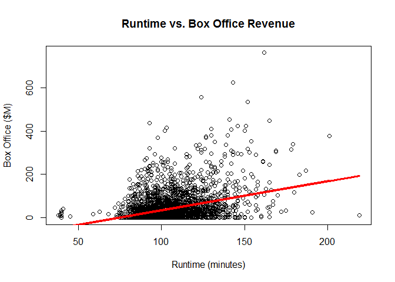
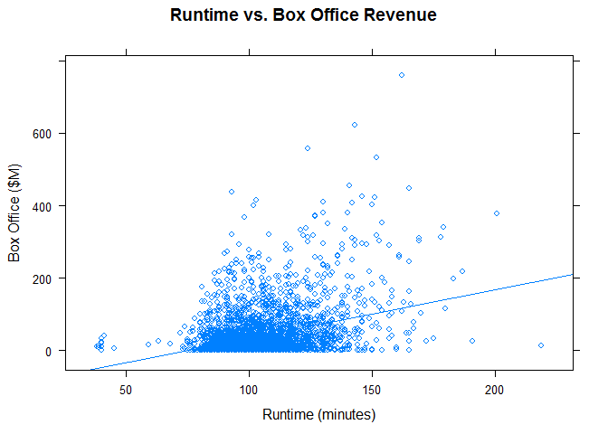
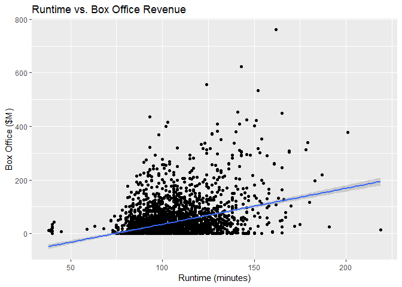

# Scatter Plot


It allows to see the relationship between two numeric variables on 2d. **Correlation** between variables.

## Correlation

* It can be strong if there a related behavior between the variables, or Weak if not.
* Positive correlation is if the drawn line points to the top right corner

## It Measures

  * Correlation
  * Shape, density of the observations

## Environment Setup

``` r
movies <- read.csv('../data/Movies.csv')
main_label <- "Runtime vs. Box Office Revenue"
runtime_in_minutes_label <- "Runtime (minutes)"
box_office_label <- "Box Office ($M)"
density_label <- "Density"
```

## Core R Library

``` r
plot(
  x = movies$Runtime,
  y = movies$Box.Office,
  main = main_label,
  xlab = runtime_in_minutes_label,
  ylab = box_office_label)
```


**Create a linear regression model**

``` r
model <- lm(movies$Box.Office ~ movies$Runtime)
```

Draw the linear regression line on the plot

``` r
plot(
  x = movies$Runtime,
  y = movies$Box.Office,
  main = main_label,
  xlab = runtime_in_minutes_label,
  ylab = box_office_label)

lines(
  x = movies$Runtime,
  y = model$fitted,
  col = "red",
  lwd = 3)
```



*As we can see there is a weak correlation between the two variables.*

## Lattice Library


``` r
xyplot(
  x = Box.Office ~ Runtime,
  data = movies,
  main = main_label,
  xlab = runtime_in_minutes_label,
  ylab = box_office_label)
```


#### Adding a regression line

``` r
xyplot(
  x = Box.Office ~ Runtime,
  data = movies,
  type = c("p","r"), # p stands for points and r stands for regression
  main = main_label,
  xlab = runtime_in_minutes_label,
  ylab = box_office_label)
```




## GGPlot Library


``` r
ggplot(
  data = movies,
  aes(x= Runtime, y = Box.Office)) + 
  geom_point() +
  ggtitle(main_label) +
  xlab(runtime_in_minutes_label) +
  ylab(box_office_label)
```


### Linear regression

Adding linear regression

``` r
ggplot(
  data = movies,
  aes(x = Runtime, y = Box.Office)) + 
  geom_point() +
  geom_smooth(method = "lm") +
  ggtitle(main_label) +
  xlab(runtime_in_minutes_label) +
  ylab(box_office_label)
```


