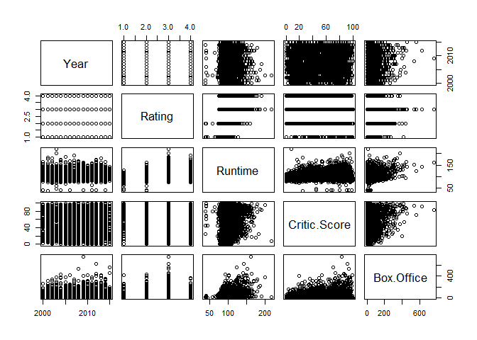
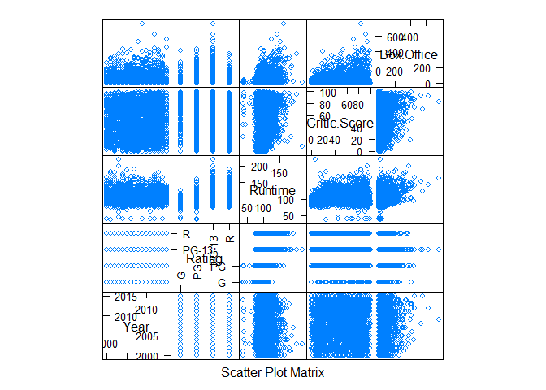
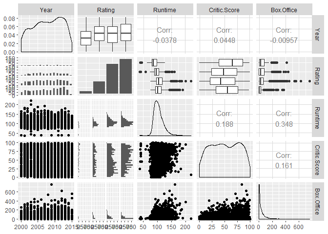

# Scatter Plot Matrix

## Highlights

* Matrix of scatterplots
* Columns and rows


## Environment Setup

``` r
library(corrgram)

movies <- read.csv("../data/movies.csv")

# Creates a correlation matrix
correlations <- cor(movies[,c(2,4,5,6)])

round(correlations,2)
```

    ##               Year Runtime Critic.Score Box.Office
    ## Year          1.00   -0.04         0.04      -0.01
    ## Runtime      -0.04    1.00         0.19       0.35
    ## Critic.Score  0.04    0.19         1.00       0.16
    ## Box.Office   -0.01    0.35         0.16       1.00
## Core R Library

``` r
plot(movies[,2:6])
```




## Lattice Library

``` r
splom(movies[,c(2:6)])
```



## GGPlot Library

``` r
library(GGally)

ggpairs(
  data = movies,
  columns = c(2:6))
```


