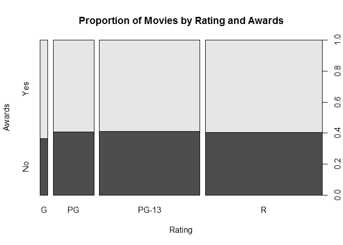

# Spined Plot

The bar width of each category on X-axis changes according to the proportion of observations, the height the count, and the color correspond to the category.

## It Measures

* Relative frequency
* Both variables

## We Can Answers Questios Like


  1. How many award-winning movies are in each rating category?
  2. What proportion of movies in each category have won awards?

## Environment Setup

Load data and create a contingency table

``` r
movies <- read.csv("../data/Movies.csv")
awards <- table(movies$Awards,
                movies$Rating)
main_title <- "Count of Movies by Rating and Awards"
rating_title <- "Rating"
movies_title <- "Count of Movies"
print(awards)
```

    ##        
    ##           G  PG PG-13   R
    ##   FALSE  34 203   502 574
    ##   TRUE   59 294   723 849


## Core R Library


We need to swamp the rows and columns for this chart.

``` r
awards <- table(
  movies$Rating,
  movies$Award)

colnames(awards) <- c("No", "Yes")

print(awards)
```

    ##        
    ##          No Yes
    ##   G      34  59
    ##   PG    203 294
    ##   PG-13 502 723
    ##   R     574 849

Create a spineplot

``` r
spineplot(
  x = awards,
  main = "Proportion of Movies by Rating and Awards",
  xlab = rating_title,
  ylab = "Awards")
```



> No Lattice nor GGPlot versions