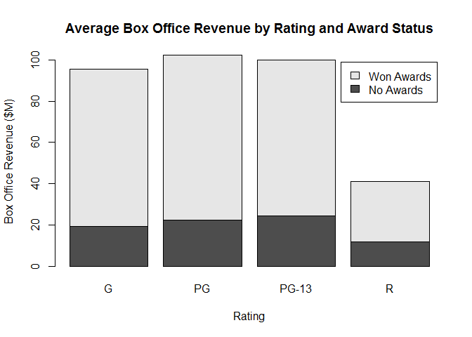
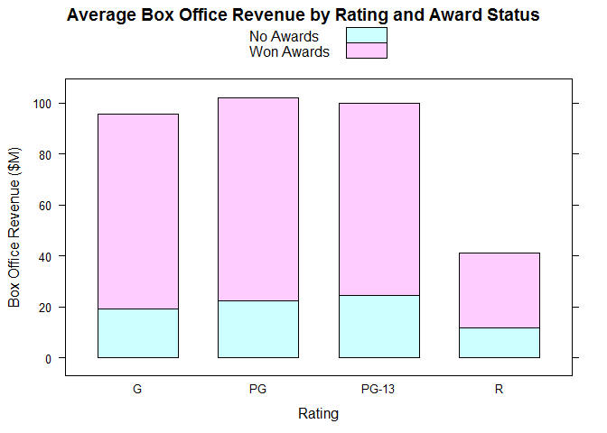
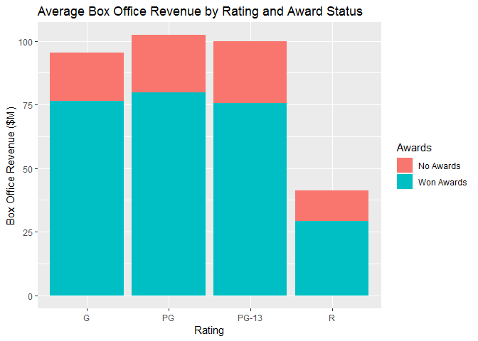

# Stack Bar Chart

Chart for 2 Qualitative and 1 Quantitative variables

## Highlights

* Stacked bars
* Aggregate measure
* Marginal value

## Environment Setup

Function to create table rows

``` r
library(tidyverse)
```

    ## Warning: package 'tidyverse' was built under R version 3.5.2

    ## -- Attaching packages ------------------------------------------------------------------------ tidyverse 1.2.1 --

    ## v ggplot2 3.0.0     v purrr   0.2.5
    ## v tibble  1.4.2     v dplyr   0.7.6
    ## v tidyr   0.8.1     v stringr 1.3.1
    ## v readr   1.1.1     v forcats 0.3.0

    ## -- Conflicts --------------------------------------------------------------------------- tidyverse_conflicts() --
    ## x dplyr::filter() masks stats::filter()
    ## x dplyr::lag()    masks stats::lag()

``` r
movies <- read.csv("../data/movies.csv")
no_awards <- "No Awards"
won_awards <- "Won Awards"

getRow <- function(awards){
  
  subset <- movies[movies$Awards == awards,]
  
  tapply(
    subset$Box.Office,
    subset$Rating,
    mean)
}

# Combine the two rows to form a table

table <- rbind(
  getRow(no_awards),
  getRow(won_awards))

# Rename the rows
rownames(table) = c(no_awards, won_awards)

print(table)
```

    ##                   G       PG    PG-13        R
    ## No Awards  19.15958 22.41607 24.42359 11.82556
    ## Won Awards 76.40349 79.87252 75.48686 29.31659

## Core R Library

``` r
barplot(
  height = table,
  beside = FALSE,
  main = "Average Box Office Revenue by Rating and Award Status",
  xlab = "Rating",
  ylab = "Box Office Revenue ($M)",
  legend = rownames(table))
```




## Latice Library

``` r
table2 %>%
  barchart(
    x = Box.Office ~ Rating,
    groups = Awards,
    main = "Average Box Office Revenue by Rating and Award Status",
    xlab = "Rating",
    ylab = "Box Office Revenue ($M)",
    auto.key =TRUE,
    stack = TRUE)
```



## GGPLot Library

``` r
ggplot(
  data = movies,
  aes(x = Rating,
      y = Box.Office,
      fill = Awards)) +
  geom_bar(
    stat = "summary",
    fun.y = "mean",
    position = "stack") +
  ggtitle("Average Box Office Revenue by Rating and Award Status") +
  xlab("Rating") +
  ylab("Box Office Revenue ($M)")
```

