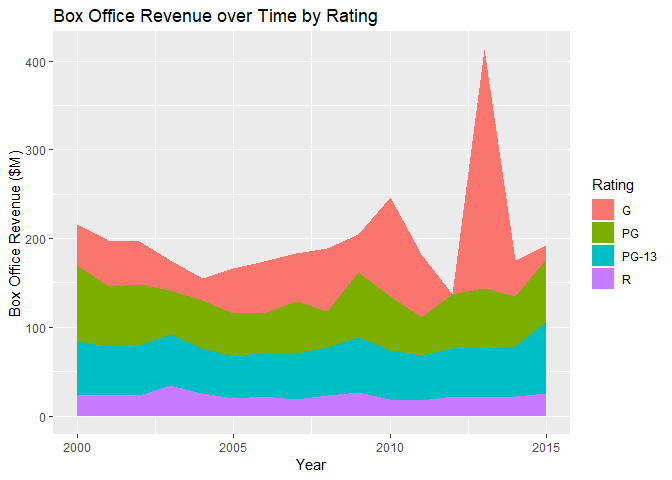

# Stacked Area Chart

## Highlights

* Area Chart
* Stacked areas
* Cumulatitve values
* Marginal values

## Environment Setup


``` r
timeSeries2 <- movies %>%
  select(Year, Rating, Box.Office) %>%
  group_by(Year, Rating) %>%
  summarize(Box.Office = mean(Box.Office)) %>%
  as.data.frame()
head(timeSeries2)
```

    ##   Year Rating Box.Office
    ## 1 2000      G   46.13333
    ## 2 2000     PG   85.74286
    ## 3 2000  PG-13   61.24286
    ## 4 2000      R   23.07253
    ## 5 2001      G   51.82000
    ## 6 2001     PG   66.84118


## GGPlot Library

``` r
timeSeries2 %>%
  ggplot(
    aes(
      x = Year,
      y = Box.Office,
      fill = Rating)) +
  geom_area() +
  ggtitle("Box Office Revenue over Time by Rating") +
  xlab("Year") +
  ylab("Box Office Revenue ($M)")
```




