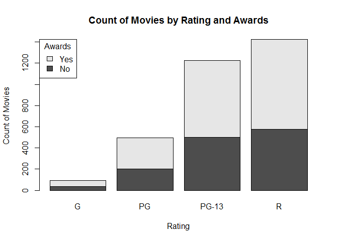
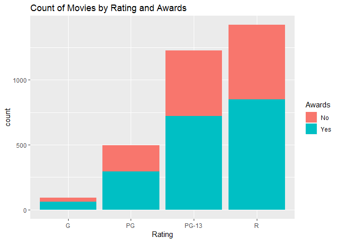

# Stacked Frequency Bar Chart


It is similar than the **Frequency Bar Chart**, but the bar are in stack.

## It Measures

    * Marginal frequency
    * Joint frequency
    * Part of whole

> Chose this data visualization when comparing the marginal frequency of one category is more important than comparing the joint frequency across categories.

## We Can Asnwer Questions like

  1. How many award-winning movies are in each rating category?
  2. What proportion of movies in each category have won awards?

## Environment Setup


Load data and create a contingency table

``` r
movies <- read.csv("../data/Movies.csv")
awards <- table(movies$Awards,
                movies$Rating)
main_title <- "Count of Movies by Rating and Awards"
rating_title <- "Rating"
movies_title <- "Count of Movies"
print(awards)
```

    ##        
    ##           G  PG PG-13   R
    ##   FALSE  34 203   502 574
    ##   TRUE   59 294   723 849

## Core R Library

``` r
barplot(
  height = awards,
  main = main_title,
  xlab = rating_title,
  ylab = movies_title,
  legend =  c("No","Yes"),
  args.legend = list(
    x = "topleft",
    title="Awards"))
```



## Lattice Library


``` r
barchart(
  x = awards,
  horizontal = FALSE,
  stack = TRUE,
  main = main_title,
  xlab = rating_title,
  ylab = movies_title,
  auto.key = list(
    x = 0.05,
    y = 0.95,
    title = "Awards",
    text = c("No","Yes")
  )
)
```


## GGPlort Library


``` r
ggplot(
  data = movies,
  aes(x = Rating, fill= Awards)) +
  geom_bar() +
  ggtitle(main_title) +
  scale_fill_discrete(labels=c("No","Yes"))
```


