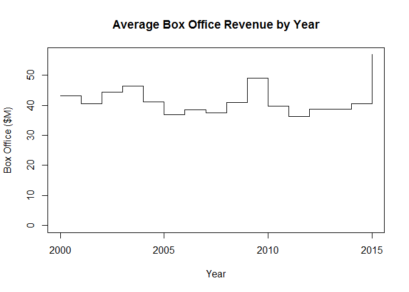

# Step Chart

## It Measures

* X-axis represent time
* Quantitative variable
* Change over time
* Constant values during period of time

## Environment Setup

### Load time series data

Load time series data

``` r
timeSeries <- read.csv("../data/Timeseries.csv")
```

Display the time series data

``` r
head(timeSeries)
```

    ##   Year Box.Office
    ## 1 2000   43.20957
    ## 2 2001   40.56887
    ## 3 2002   44.26228
    ## 4 2003   46.44941
    ## 5 2004   41.16540
    ## 6 2005   36.78063

## Core R Library


``` r
plot(
  x = timeSeries,
  type = "s",
  ylim = c(0, max(timeSeries$Box.Office)),
  main = "Average Box Office Revenue by Year",
  xlab = "Year",
  ylab = "Box Office ($M)")
```



## Lattice Library


``` r
xyplot(
  x = Box.Office ~ Year,
  data = timeSeries,
  type = 's',
  ylim = c(0,max(timeSeries$Box.Office)),
  main = "Average Box Office Revenue by Year",
  xlab = "Year",
  ylab = box_office_label)
```


## GGPlot Library


``` r
ggplot(
  data = timeSeries,
  aes(x = Year, y = Box.Office)) +
  geom_step() +
  expand_limits(y = 0) + 
  ggtitle("Box Office Revenue by Year") +
  xlab("Year") +
  ylab(box_office_label)
```


