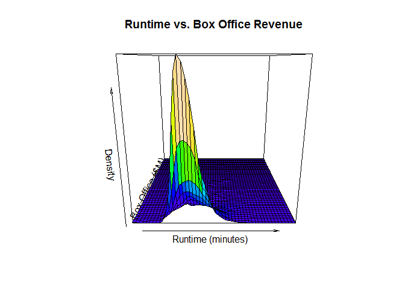

# Surface Plot

Similar to Mesh plot, but they do not have warped mesh draped on the surface on the plot, rather, they draped color to display density

## It Measures

* Draped with color
* Pros & Cons
    - By giving up the warped mesh we can no longer easly trace any x or y along the surface of the plot to see what elevation is at that point
    - It is easier to see the relative elevation of multiple peaks


## MASS Package

It requires [MASS package](mass_package.md)


## Environment Setup

``` r
movies <- read.csv('../data/Movies.csv')
main_label <- "Runtime vs. Box Office Revenue"
runtime_in_minutes_label <- "Runtime (minutes)"
box_office_label <- "Box Office ($M)"
density_label <- "Density"
```

## Core R Library


``` r
palette(topo.colors(100))

persp(
  x = density2d$x,
  y = density2d$y,
  z = density2d$z,
  col = cut(density2d$z,100),
  main = main_label,
  xlab = runtime_in_minutes_label,
  ylab = box_office_label,
  zlab = density_label)
```



Reset the color palette to default

``` r
palette("default")
```


## Lattice Library


Create surface plot of density

``` r
wireframe(
  x = z ~ x * y,
  data = grid,
  drape = TRUE,
  main = main_label,
  xlab = runtime_in_minutes_label,
  ylab = box_office_label,
  zlab = density_label)
```


