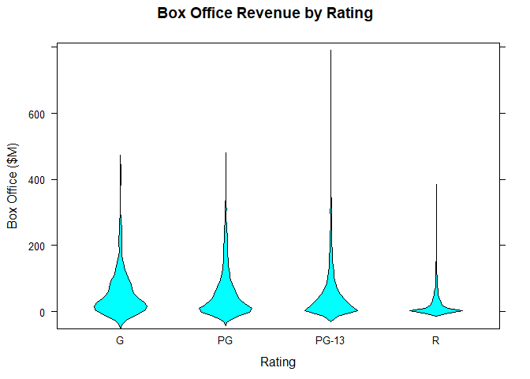
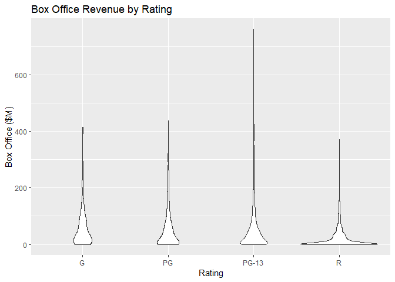

# Bivariate Violin Plot

## It Measures

* Density
* Shape

## Environment Setup

``` r
movies <- read.csv("../data/Movies.csv")
main_label <- "Average Box-Office Revenue by Rating"
rating_label <- "Rating"
box_office_label <- "Box Office ($M)"
library(lattice)
```

Install dplyr library `install.packages("dplyr")`

``` r
library("dplyr")
```

    ## Warning: package 'dplyr' was built under R version 3.5.2

    ## 
    ## Attaching package: 'dplyr'

    ## The following objects are masked from 'package:stats':
    ## 
    ##     filter, lag

    ## The following objects are masked from 'package:base':
    ## 
    ##     intersect, setdiff, setequal, union

## Lattice Library


``` r
bwplot(
  x = Box.Office ~ Rating,
  data = movies,
  panel = panel.violin,
  main = main_label,
  xlab = rating_label,
  ylab = box_office_label)
```



## GGPlot Library


``` r
ggplot(
  data = movies,
  aes(x= Rating, y = Box.Office)) +
  geom_violin() +
  ggtitle(main_label) +
  xlab(rating_label) +
  ylab(box_office_label)
```

