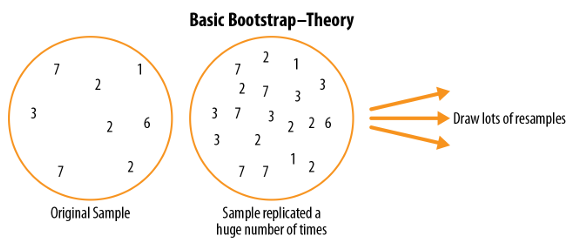
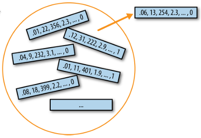

# Bootstrap

> It is not the same than [Monte Carlo Simulation](../../probability/monte_carlo_simulation.md), since Bootstrap uses the data, and Monte Carlo uses simulation of the data.

One easy and effective way to estimate the sampling distribution of a statistic, or of model parameters, is to draw additional samples, with replacement, from the sample itself and recalculate the statistic or model for each resample.

* **Bootstrap Sample**, it's a sample taken with replacement from an observed data set

* **Resampling**, The process of taking repeated samples from observed data, includes both, bootstrap and permutation (shuffling) procedures.

Conceptually, you can imagine the bootstrap as replicating the original sample thousands or millions of times so that you have a hypothetical population that embodies all the knowledge from your original sample (it’s just larger). You can then draw samples from this hypothetical population for the purpose of estimating a sampling distribution.



In practice, it is not necessary to actually replicate the sample a huge number of times.  We simply replace each observation after each draw; that is, we  sample with replacement. In this way we effectively create an infinite population in which the probability of an element being drawn remains unchanged from draw to draw.

Algorithm

1. Draw a sample value, record it, and then replace it.
2. Repeat  n  times.
3. Record the mean of the  n  resampled values.
4. Repeat steps 1–3  R  times.
5. Use the  R  results to:
   1. Calculate their standard deviation (this estimates sample mean standard error).
   2. Produce a histogram or boxplot.
   3. Find a confidence interval.

```r
library(boot) 

stat_fun  <-  function(x,  idx) median(x[idx])
boot_obj  <-  boot(loans_income,  R=1000,  statistic=stat_fun)
```
Bootstrap  Statistics  : 

|     | original | bias     | std.  error |
|-----|:--------:|:--------:|:-----------:|  
|t1*  |62000     |-70.5595  | 209.1515    |

The major  Python  packages don’t provide implementations of the bootstrap approach. It can be implemented using the  scikit-learn  method  resample:

```python
 results  =  [] 
 for  nrepeat  in  range(1000):
    sample  =  resample(loans_income)
    results.append(sample.median()) 

results  =  pd.Series(results)
print('Bootstrap Statistics:')
print(f'original: {loans_income.median()}')
print(f'bias: {results.mean() - loans_income.median()}')
print(f'std. error: {results.std()}')
 ```

 The bootstrap can be used with multivariate data, where the rows are sampled as units. A model  might then be run on the bootstrapped data, for example, to estimate the stability (variability) of model parameters, or to improve predictive power. With classification and regression trees (also called  decision trees), running multiple trees on bootstrap samples and then averaging their predictions (or, with classification, taking a majority vote) generally performs better than using a single tree.  This process is called  bagging  (short for “bootstrap aggregating”)



> The bootstrap does not compensate for a small sample size; it does not create new data, nor does it fill in holes in an existing data set. It merely informs us about how lots of additional samples would behave when drawn from a population like our original sample.

## Resampling Versus Bootstrapping

Sometimes the term  resampling  is used synonymously with the term  bootstrapping, as just outlined. More often, the term  resampling  also includes permutation procedures, where multiple samples are combined and the sampling may be done without replacement. In any case, the term  **bootstrap  always implies sampling with replacement** from an observed data set.

