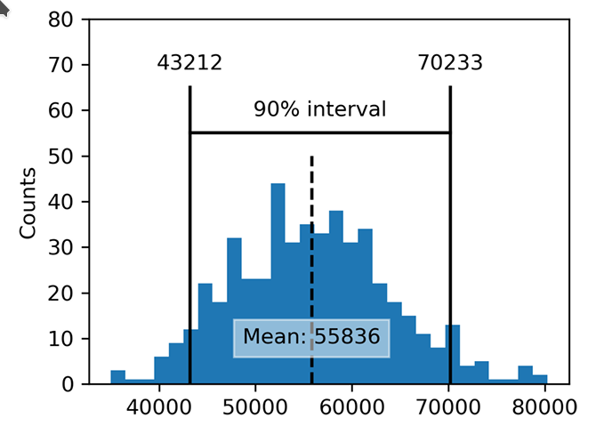

# Confidence Interval

Frequency tables, histograms, boxplots, and standard errors are all ways to understand the potential error in a sample estimate. Confidence intervals are another.

* **Confidence Level**. The percentage of confidence intervals, constructed in the same way from the same population, that are expected to contain the statistic of interest.

* **Interval Endpoints**. The top and bottom of the interval confidence.

Confidence intervals always come with a **coverage level**, expressed as a (high) percentage, say 90% or 95%. One way to think of a 90% confidence interval is as follows: **it is the interval that encloses the central 90% of the bootstrap sampling distribution of a sample statistic**. More generally, an  x% confidence interval around a sample estimate should, on average, contain similar sample estimates  x% of the time (when a similar sampling procedure is followed).

Given a sample of size  n, and a sample statistic of interest, the algorithm for a bootstrap confidence interval is as follows:

1. Draw a random sample of size  n  with replacement from the data (a resample).
2. Record the statistic of interest for the resample.
3. Repeat steps 1–2 many (R) times.
4. For an  x% confidence interval, trim [(100-x) / 2]% of the  R  resample results from either end of the distribution.
5. The trim points are the endpoints of an  x% bootstrap confidence interval.

This shows a 90% confidence interval for the mean annual income of loan applicants, based on a sample of 20 for which the mean was $55,836.

The bootstrap is a general tool that can be used to generate confidence intervals for most statistics, or model parameters. Statistical textbooks and software, with roots in over a half century of computerless statistical analysis, will also reference confidence intervals generated by formulas, especially the t-distribution.

> Of course, what we are really interested in when we have a sample result is, “What is the probability that the true value lies within a certain interval?” This is not really the question that a confidence interval answers, but it ends up being how most people interpret the answer. The probability question associated with a confidence interval starts out with the phrase “Given a sampling procedure and a population, what is the probability that…” To go in the opposite direction, “Given a sample result, what is the probability that (something is true about the population)?” involves more complex calculations and deeper imponderables.

The percentage associated with the confidence interval is termed the  level of  confidence. The higher the level of confidence, the wider the interval. Also, the smaller the sample, the wider the interval (i.e., the greater the uncertainty). Both make sense: **the more confident you want to be, and the less data you have, the wider you must make the confidence interval to be sufficiently assured of capturing the true value**.

> For a data scientist, a confidence interval is a tool that can be used to get an idea of how variable a sample result might be.  Data scientists would use this information not to publish a scholarly paper or submit a result to a regulatory agency (as a researcher might) but most likely to communicate the potential error in an estimate, and perhaps to learn whether a larger sample is needed.
