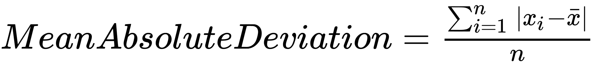
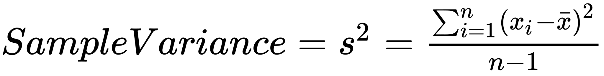

# Deviation

> A.K.A. Differences

One of the most popular estimates of variations is based on differences, or deviations, between the estimate of location and the observed data.

* It's not Robust to outliers or extreme values
* We take absolute value from the difference.
* Formula <!-- $Mean Absolute Deviation = \frac{\sum_{i=1}^n|x_i-\bar{x}|}{n}$ --> 


# Variance

> Popular way to calculate de deviations in Statistics

* Really sensitive to outliers, no Robust
* Variance formula for:
  * <!-- $SampleVariance= s^2 = \frac{\sum_{i=1}^n(x_i-\bar{x})^2}{n-1}$ --> 
  * <!-- $PopulationVariance= \sigma^2 = \frac{\sum_{i=1}^n(x_i-\mu)^2}{N}$ --> 

# Standard Deviation

* Really sensitive to outliers, no Robust
* Same scale than original data, so easier to interpret
* Formula
  * $StandardDeviation= s = \sqrt{Variance}$

R
```r
sd(state[['Population']])
```

Python
``` python
state['Population'].std()
```