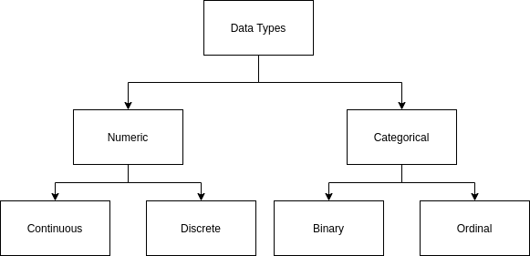

# Elements of Structured Data

## Data Types

* Numeric: Data that can take on any value in an interval
  * Continous: Data that can take any value in a range
  * Discrete: Data that can take any integer value
* Categorical: Data that can take on only a specific set of values representing a set of possible categories
  * Binary: Special case of categorical data with just two categories
  * Ordinal: Categorical data that has an explicit ordering