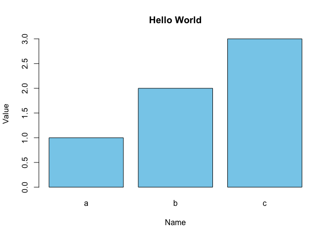

# Mode

The most commonly occuring category or value in data set.

## Bar Chart to identify Mode

```r
barplot(as.matrix(dfw) / 6, cex.axis=0.8, cex.names=0.7,
xlab='Cause of delay', ylab='Count')
```


```python
ax = dfw.transpose().plot.bar(figsize=(4, 4), legend=False)
ax.set_xlabel('Cause of delay')
ax.set_ylabel('Count')
```




> The mode is a simple summary statistic for
categorical data, and it is generally not used for numeric data.


