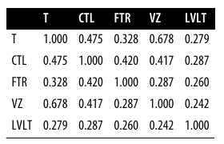

# Correlation

## Highlights

* Positive correlation: if the values of the variables increase or decrease.
* Negative correlation: if one variable value increases while the another one decreases.
* **Useful only** when the variables have a linear correlation

## Correlation Coefficient

* It gives an estimate of the correlation between two variables that always lies on the same scale
* Range -1 to 1
  * -1 Perfect negative correlation
  * 1 Perfect positive correlation
  * 0 No correlation at all
* Formula

<!-- $r=\frac{\sum_{i=1}^n(x_i-\bar{x})(y_i-\bar{y})}{(n-1)s_xs_y}$ --> 

## Correlation Matrix

* It contains the correlation between multiple variables.
* Diagonal of 1 values
* Redundancy of values above and below the diagonal

### Correlation Table

Example

### Correlation Graph
Example

