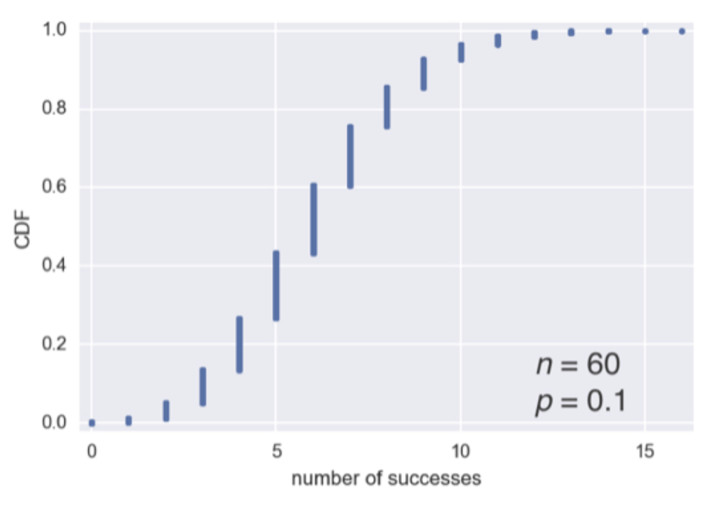

# Binomial distribution

## Description

The number of **r** successes in **n** Bernoulli trials with probability **p** of success, is Binomially distributed.

> The probability of the two possible outcomes doesn't need to be 50/50.

> It's conventional in statistics to term the "1" outcome to the success outcome; it is also a common practice to assign "1" to the more rare outcome. Use of the term **success** does not imply that the outcome is desirable or beneficial,but it does tend to indicate the outcome of interest.

> There is a family of binomial distributions, depending on the values of **n** and **p**.

* **Mean** - it's *n * p* => that is the expected number of successes in *n* trials, for success probability = *p*

* **Variance** - it's *n * p(1-p)* with a large enough number of trials (particulary when p is close to 0.50).

**The binomial distribution is virtually indistinguishable from the normal distribution. In fact, calculating binomial probabilities with large sample sizes is computationally demanding, and most statistical procedures use the normal distribution, with mean and variance, as an approximation.**

### Example

The number **r** of heads in **4 coin flips** with probability **0.5** of heads, is Binomially distributed.

## Code

np.random.binomial(n, p, size=None)

Where

* n = number of trials
* p = probability of success
* size = number of samples

Python code

```python
' Example of binomial sample '
np.random.binomial(4, 0.5)

' Example of serie of binomial samples '
np.random.binomial(4, 0.5, size=10)
```

R code

```r
dbinom(x=2, size=5, p=0.1)
# 0.0729 -> It's the probablity of observing exactly x = 2 successes in size = 5 trials, where the probability of success for each trial is p = 0.1

' Example for getting x or fewer successes in n trials '
pbinom(2, 5, 0.1)
# 0.9914 -> It's the probability of observing two or fewer success in five trials, where the probability success for each trial is 0.1
```

## Binomial PMF

```python
samples = np.random.binomial(60, 0.1, size=10000)
```


Also the next library can be used.

```python
stats.binom.pmf(2, n=5, p=0.1)
```

## Cumulative distribution function (CDF)

We can get the same information from CDF than using the PMF, but simpler to plot in python

```python
x, y = ecdf(samples)
plt.plot(x, y, marker=".", linestyle="none")
plt.margins(0.02)
plt.xlabel("number of success")
plt.ylabel("CDF")
```



Also the next library can be used.

```python
stats.binom.cdf(2, n=5, p=0.1)
```
